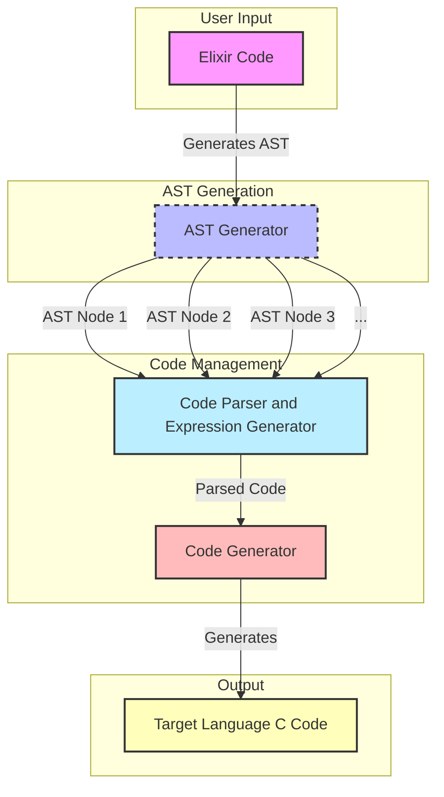
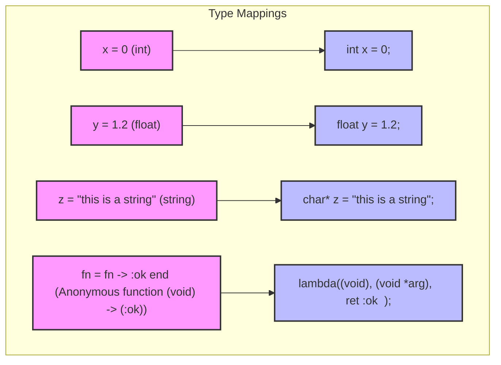
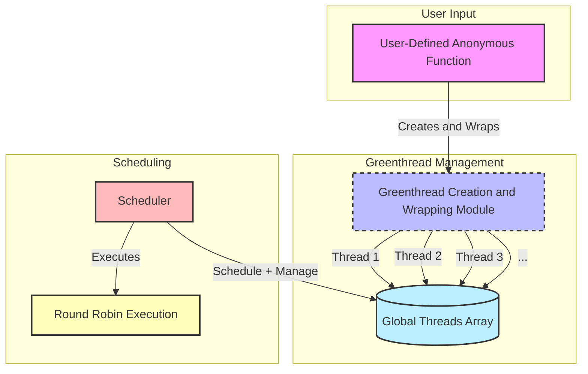
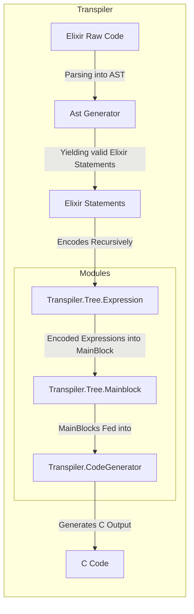
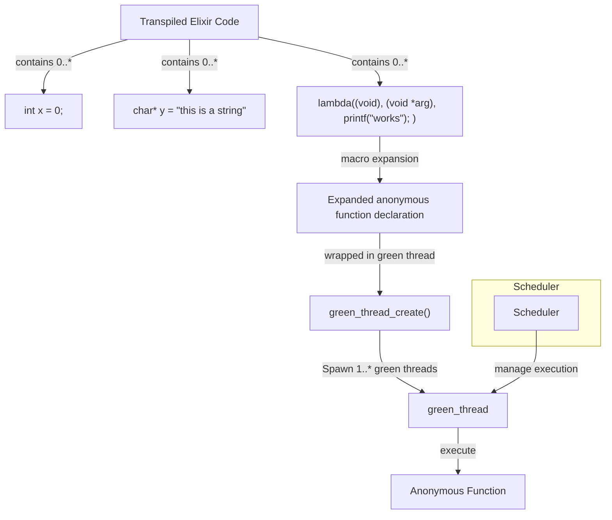

# Elixir-To-C Transpiler

## Comprehensive Overview

### Introduction

* Project Goal
* Project Motivation

### Prior Knowledge

* Green Threads
* Round Robin

### Project Roadmap

* Diagram
* Different Project Phases

### Project Description

* Elixir Subset Code
* Targeted Features

### Architecture Overview

* Description
* Key Design Goals

### Transpilation Phase

* Front-End Part
* Back-End Part

### Run Time

* Architecture
* Features Implementation

### Code Walkthrough

* Elixir -> AST + Code Generation
* C      -> Runtime (Obz_VM)

### Live Demonstration

* Simple Examples
* Comparison: C vs Obz_VM

### Limitation & Future Works

* Constraints
* Potential Improvement

### Conclusion

* Project Summary
* Key Learnings

### References

* Primary
* Secondary

<!-- livebook:{"break_markdown":true} -->

### Introduction

<!-- livebook:{"break_markdown":true} -->

#### **Brief Intro**

* **Objective:**
  * Develop a transpiler that converts Elixir code into high-performance C code
* **Key Features:**
  * Preserve Elixir's functional programming paradigms
  * Maintain Elixir's concurrency capabilities using green threads
* **Significance:**
  * Bridge the gap between high-level functional programming and low-level performance-oriented languages
  * Enable Elixir-like abstractions in environments where the BEAM VM is not suitable
* **Expected Outcome:**
  * Efficient C code that leverages Elixir's concurrency and functional features for scalable applications

---

#### **Project Goals**

* **Goal 1:**
  * Explore the potential of transpiling Elixir’s functional and concurrent features into high-performance C
* **Goal 2:**
  * Enable the utilization of Elixir’s abstractions in environments where the BEAM VM is not viable

---

<!-- livebook:{"break_markdown":true} -->

### Prior Knowledge

<!-- livebook:{"break_markdown":true} -->

#### Different Types of Threads

| Feature                | POSIX Processes           | POSIX Threads (pthreads)          | Green Threads                        |
| ---------------------- | ------------------------- | --------------------------------- | ------------------------------------ |
| **Management**         | OS-level                  | OS-level                          | User-level (runtime library)         |
| **Memory Space**       | Separate                  | Shared within process             | Can be isolated (customizable)       |
| **Overhead**           | High (resource-intensive) | Moderate (lighter than processes) | Low (very lightweight)               |
| **Communication**      | IPC mechanisms required   | Direct shared memory              | Direct or through runtime mechanisms |
| **Scheduling Control** | OS-managed                | OS-managed                        | Customizable (e.g., round-robin)     |
| **Scalability**        | Limited by high overhead  | Moderate scalability              | High scalability                     |
| **Fault Isolation**    | Strong isolation          | Weak isolation (shared memory)    | Configurable isolation               |

* **Relevance to the Project:**
  * **Choice of Green Threads:**
    * Aligns with requirements for high concurrency and low overhead
    * Offers flexibility to implement custom scheduling and fault tolerance mechanisms
  * **Enhanced Control:**
    * Complete control over thread behavior, scheduling policies, and fault handling strategies
  * **Resource Efficiency:**
    * Handles a large number of concurrent tasks without significant memory and CPU overhead

---

#### Round Robin in Scheduling

##### **Definition**

* **Round Robin (RR):**
  * Scheduling algorithm that assigns each thread a fixed time slice (quantum) in a cyclic order
  * Ensures fair allocation of CPU time among all threads

---

##### **Key Characteristics**

* **Time Slices (Quanta):**
  * Each thread is given a fixed time period to execute
  * If a thread doesn't complete within its time slice, it is preempted
* **Cyclic Order:**
  * Threads are arranged in a circular queue
  * After a thread's time slice expires, it moves to the end of the queue
* **Fairness:**
  * Guarantees equal opportunity for all threads to execute
  * Prevents any single thread from monopolizing CPU time
* **Predictable Performance:**
  * Fixed time slices provide consistent and predictable response times
  * Suitable for real-time and time-sensitive applications

---

##### **Advantages & Disadvantages**

| **Advantages**                                                     | **Disadvantages**                                                                                 |
| ------------------------------------------------------------------ | ------------------------------------------------------------------------------------------------- |
| **Simplicity:**                                                    | **Context Switching Overhead:**                                                                   |
| - Easy to implement and understand                                 | - Frequent preemption and context switching can introduce significant overhead                    |
| - Straightforward logic for managing thread queues and time slices | - Especially impactful with a large number of threads or very short time slices                   |
| **Fairness:**                                                      | **Time Slice Selection:**                                                                         |
| - Ensures all threads receive an equal share of CPU time           | - Critical to choose appropriate time slice duration                                              |
| - Balanced performance across concurrent tasks                     | - Too short leads to excessive context switching; too long causes delays in thread responsiveness |
| **Responsiveness:**                                                | **Not Optimal for All Workloads:**                                                                |
| - Timely execution of threads                                      | - May perform poorly with threads of varying execution times                                      |
| - Prevents indefinite delays for any thread                        | - Inefficiency when short tasks are delayed behind long-running threads                           |

---

##### **Relevance to the Project**

* **Preemptive Multitasking:**
  * Enables automatic management of thread execution without manual intervention
* **Fair CPU Time Distribution:**
  * Prevents any single green thread from monopolizing system resources
* **Performance Optimization:**
  * Balances fairness and performance by controlling time slice duration and optimizing context switching
* **Scalability:**
  * Suitable for managing a large number of green threads, supporting extensive parallelism

---

##### **Implementation in the Project**

* **Scheduler Module:**
  * Implements the round-robin scheduling policy
  * Cycles through the Global Threads Array, allocating time slices to each green thread
* **Context Switching:**
  * Employs efficient mechanisms to reduce overhead
  * Ensures the scheduler can manage numerous green threads without significant performance penalties
* **Adaptability:**
  * Design allows for future enhancements (e.g., dynamic time slices, priority adjustments) to optimize performance based on runtime conditions

---

<!-- livebook:{"break_markdown":true} -->

### Project Roadmap

<!-- livebook:{"break_markdown":true} -->

<!-- Learn more at https://mermaid-js.github.io/mermaid -->


<!-- livebook:{"break_markdown":true} -->

#### **1. Input: Elixir**

* **Description:**

  * User provides raw Elixir source code.
  * Elixir's high-level syntax and concurrency features form the transpilation foundation.

* **Key Activities:**

  * Collect Elixir modules, functions, and anonymous functions.
  * Ensure Elixir code adheres to expected syntax and semantics for accurate transpilation.

---

#### **2. Transpiler Phase**

* **Description:**

  * Converts input Elixir code into equivalent C code through a systematic transpilation process.
  * Ensures core Elixir semantics are retained in the generated C code.

* **Key Activities:**

  * **Parsing:**
    * Analyze Elixir code to generate an Abstract Syntax Tree (AST).
    * Capture structural and syntactic elements.
  * **Type Mapping:**
    * Translate Elixir data types and constructs into corresponding C types.
    * Maintain type safety and functional integrity.
  * **Handling Anonymous Functions:**
    * Utilize C macros and GCC statement blocks.
    * Emulate Elixir's anonymous functions within the C environment.
  * **Code Generation:**
    * Produce well-structured and optimized C code mirroring original Elixir behavior.
  * **Modularity:**
    * Organize transpiler into specialized modules:
      * `Transpiler.Tree.Expression`
      * `Transpiler.Tree.MainBlock`
      * `Transpiler.CodeGenerator`
    * Enhance maintainability and scalability.

---

#### **3. Runtime**

* **Description:**

  * Executes transpiled C code, implementing concurrency and fault tolerance through green threads.
  * Ensures efficient execution, scalability, and robustness of the generated executable.

* **Key Activities:**

  * **Green Thread Management:**
    * Create and manage lightweight green threads for concurrent task execution.
  * **Scheduler Implementation:**
    * Utilize a preemptive round-robin scheduling algorithm.
    * Allocate CPU time slices fairly among green threads.
  * **Fault Tolerance Mechanisms:**
    * Incorporate the "Let it Crash" philosophy.
    * Isolate faults to maintain system stability despite individual thread failures.
  * **Resource Management:**
    * Handle memory allocation through isolated heaps.
    * Minimize overhead associated with thread management.
  * **Integration with Transpiler:**
    * Ensure seamless interaction between generated C code and runtime concurrency/fault tolerance systems.

---

#### **4. Output: Executable**

* **Description:**

  * Produces a compiled executable binary from transpiled C code.
  * Executable embodies original Elixir functionality and concurrency model, optimized for performance and reliability.

* **Key Activities:**

  * **Compilation:**
    * Use a C compiler to compile generated C code into an executable binary.
  * **Linking:**
    * Resolve dependencies and link executable with necessary libraries, including the custom green thread library.
  * **Deployment:**
    * Prepare executable for deployment.
    * Ensure efficient performance on target environments.
  * **Testing and Validation:**
    * Conduct thorough testing to verify executable behavior.
    * Maintain semantics of original Elixir code.

---

<!-- livebook:{"break_markdown":true} -->

###

<!-- livebook:{"break_markdown":true} -->

### Project Description

<!-- livebook:{"break_markdown":true} -->

#### Subset of Elixir :

| Name                   | Elixir Subset   | C lang counterpart                                                |
| ---------------------- | --------------- | ----------------------------------------------------------------- |
| variable binding       | x = 10          | int x = 10 ;                                                      |
| -                      | y = "hamid "    | char* y = "hamid"                                                 |
| anonymous function     | fn _ -> :ok end | lambda(void, (void* arg), { ret :ok ;})                           |
| spawning processes     | &spawn/1        | green_thread_creat(lambda(void, (void* arg), { ret :ok ;}), NULL) |
| printing to the stdout | &IO.inspect/1   | printf("%s /n")                                                   |

##### Target Features:

* **Fault Tolerance:**

  * Implement mechanisms to handle runtime errors gracefully
  * Isolate faults to prevent system-wide crashes

* **Out of The Box Concurrency:**

  * Seamless concurrent execution without additional setup
  * Pre-configured green thread scheduler
  * Efficient management of multiple concurrent tasks
  * Support for high scalability and resource efficiency

<!-- livebook:{"break_markdown":true} -->

### Architecture Overview

<!-- livebook:{"break_markdown":true} -->

<!-- Learn more at https://mermaid-js.github.io/mermaid -->



##### Description

* **User Input**

  * **Elixir Code**: The process begins with the user providing Elixir source code that needs to be translated into C.

* **AST Generation**

  * **AST Generator**: The Elixir code is parsed to create an Abstract Syntax Tree (AST), representing the structural syntax of the code.

* **Code Management**

  * **Code Parser**: Individual AST nodes are parsed to understand their specific constructs and semantics.
  * **Expression Generator**: Generates expressions based on the parsed AST nodes to facilitate code translation.

* **Code Generation**

  * **Code Generator**: Combines parsed code and generated expressions to construct the corresponding C code.

* **Output**

  * **Target C Code**: The final output is the generated C code that mirrors the functionality of the original Elixir code.

##### Workflow Overview

* **Elixir Code Input**: Users provide Elixir code as the starting point.
* **AST Creation**: The AST Generator converts the Elixir code into an Abstract Syntax Tree.
* **Parsing and Expression Generation**: Each node of the AST is parsed, and corresponding expressions are generated.
* **C Code Generation**: The Code Generator uses the parsed information to produce equivalent C code.
* **Final Output**: The translated C code is delivered as the final output.

<!-- livebook:{"break_markdown":true} -->

### Transpilation Process

<!-- livebook:{"break_markdown":true} -->

#### Parsing Elixir Source Code

<!-- livebook:{"break_markdown":true} -->

<!-- Learn more at https://mermaid-js.github.io/mermaid -->



<!-- livebook:{"break_markdown":true} -->

#### **Type Mappings**

* **Variable Binding:**

  * **Elixir:** `x = 0` *(int)*  
    **C:** `int x = 0;`
  * **Elixir:** `y = "hamid"` *(string)*  
    **C:** `char* y = "hamid";`

* **Anonymous Function:**

  * **Elixir:** `fn -> :ok end` *(Anonymous function (void) -> (:ok))*  
    **C:** `lambda(void, (void* arg), { return :ok; });`

* **Spawning Processes:**

  * **Elixir:** `spawn/1`  
    **C:** `green_thread_create(lambda(void, (void* arg), { return :ok; }), NULL);`

* **Printing to Stdout:**

  * **Elixir:** `IO.inspect/1`  
    **C:** `printf("%s \n", "message");`

---

#### **Overall Role in the Project**

* **Seamless Type Translation:**

  * Ensures accurate translation of Elixir variables and functions to C's strict typing system
  * Maintains type safety and functional integrity

* **Macro Utilization:**

  * Leverages C's powerful macro system to handle complex type translations and function mappings
  * Emulates Elixir's anonymous functions using macros and GCC statement blocks

* **Foundation for Code Generation:**

  * Serves as the foundational layer for the Code Generator module
  * Enables generation of syntactically correct and semantically equivalent C code from the parsed Elixir AST

* **Enhancing Flexibility and Concurrency:**

  * Facilitates implementation of flexible anonymous functions
  * Develops a simple green thread library to handle modern programming constructs and concurrent execution

---

<!-- livebook:{"break_markdown":true} -->

### Parsing Phase

#### **1. Parsing in Elixir**

* **Definition:**

  * Foundational step in transpilation process
  * Analyzes and transforms Elixir code into a structured representation (AST)

* **Metaprogramming:**

  * Utilizes Elixir's powerful metaprogramming capabilities
  * Parses code into an Abstract Syntax Tree (AST) for subsequent translation

---

#### **2. How Parsing in Elixir Works**

* **Code Parsing:**

  * **Tool:** `Code.string_to_quoted/1`
  * **Function:** Converts Elixir code string into a nested tuple structure representing the AST

* **Parsing Steps:**

  1. **Lexical Analysis:**

     * Breaks raw code into tokens:
       * **Identifiers:** Variable names (e.g., `x`)
       * **Operators:** Symbols (e.g., `+`, `=`)
       * **Literals:** Numbers, strings (e.g., `5`, `"Hello"`)
       * **Delimiters:** Parentheses, commas (e.g., `(`, `)`, `,`)

  2. **Syntactic Analysis:**

     * Organizes tokens into a hierarchical AST based on Elixir's grammar rules
     * Forms a tree-like structure capturing relationships and nesting of code constructs:
       * **Function Calls**
       * **Variable Assignments**
       * **Control Flow Statements**

  3. **Macro Expansion:**

     * Expands macros (dynamic metaprogramming constructs) during parsing
     * Results in a detailed AST that incorporates the expanded code

---

#### **3. AST Parser**

* **What is an AST?**

  * **Abstract Syntax Tree (AST):**
    * Structured, navigable representation of source code
    * Composed of nested tuples and lists encapsulating syntactic structure

* **Example AST Structure:**

  * **Elixir Code:**

    ```elixir
    x = 5 + 3
    ```

  * **Generated AST:**

    ```elixir
    {:assign, [context: Elixir, import: Kernel],
     [
       {:x, [context: Elixir], nil},
       {:+, [context: Elixir], [5, 3]}
     ]}
    ```

  * **Explanation:**

    * **Outer Tuple (`{:assign, ...}`):**
      * Represents an assignment operation (`=`)
    * **First Element (`{:x, ...}`):**
      * Denotes the variable `x`
    * **Second Element (`{:+, ...}`):**
      * Represents the binary operation `5 + 3`

---

#### **4. AST Elixir Example and Code Explanation**

* **Complex Example:**
  * **Elixir Code:**

    ```elixir
    spawn(fn -> IO.inspect("Hello, World!") end)
    ```

  * **Generated AST:**

    ```elixir
    {:spawn, [context: Elixir, import: Kernel],
     [
       {:fn, [context: Elixir],
        [
          {:->, [context: Elixir],
           [
             [],
             {{:., [context: Elixir], [{:__aliases__, [alias: false], [:IO]}, :inspect]},
              [context: Elixir], ["Hello, World!"]}
           ]}
        ]}
     ]}
    ```

  * **Explanation:**

    * **Outer Tuple (`{:spawn, ...}`):**
      * Represents the `spawn` function call
    * **Anonymous Function (`{:fn, ...}`):**
      * Defines an anonymous function passed to `spawn`
    * **Function Clause (`{:->, ...}`):**
      * Contains:
        * **Arguments:** `[]` (none in this case)
        * **Body:** 
          * **Function Call (`{:., ...}`):**
            * Dot operator call to `IO.inspect("Hello, World!")`
            * **Module Alias (`{:__aliases__, ...}`):** Represents `IO`
            * **Function Name:** `:inspect`
            * **Arguments:** `"Hello, World!"`

---

<!-- livebook:{"break_markdown":true} -->

### **Translating Elixir Constructs to C**

#### **Mapping Constructs**

##### **1. Variable Assignments**

* **Elixir:**
  ```elixir
  x = 5
  ```
* **C:**
  ```c
  int x = 5;
  ```
* **Explanation:**
  * Infers variable type based on assigned value.
  * Generates appropriate C declaration and initialization.

##### **2. Function Calls**

* **Elixir:**
  ```elixir
  IO.inspect(x)
  ```
* **C:**
  ```c
  printf("%d \n", x);
  ```
* **Explanation:**
  * Maps `IO.inspect` to C's `printf`.
  * Uses format specifiers based on variable type.

##### **3. Anonymous Functions (`fn`)**

* **Elixir:**
  ```elixir
  fn -> IO.inspect("Hello") end
  ```
* **C:**
  ```c
  lambda(void, (void* arg), { printf("%s \n", "Hello"); })
  ```
* **Explanation:**
  * Utilizes `lambda` macro to create function pointers in C.
  * Enables passing anonymous functions to runtime's thread creation.

##### **4. Spawning Processes**

* **Elixir:**
  ```elixir
  spawn(fn -> ... end)
  ```
* **C:**
  ```c
  green_thread_create(lambda(void, (void* arg), { /* function body */ }), NULL);
  ```
* **Explanation:**
  * Maps `spawn` to runtime's `green_thread_create`.
  * Executes provided anonymous function as a lambda expression.

##### **5. Concurrency Primitives**

* **Elixir:**
  * Lightweight processes managed by the BEAM VM.
* **C:**
  * **Green Threads:**
    * Implemented using user-level threads managed by the custom scheduler.
  * **Message Passing (if needed):**
    * Emulated using shared data structures and synchronization mechanisms.

---

#### **Elixir’s `spawn` Mapped to C Runtime Functions (`green_thread_create`)**

##### **Elixir `spawn` Usage**

* **Elixir Code:**
  ```elixir
  spawn(fn -> IO.inspect("Hello, World!") end)
  ```

##### **Transpiled C Equivalent**

* **C Code:**
  ```c
  green_thread_create(
      lambda(void, (void* arg), { printf("%s \n", "Hello, World!"); }), NULL);
  ```

#### **Explanation**

##### **1. Lambda Macro**

* **Purpose:**
  * Creates an anonymous function in C.
* **Parameters:**
  * **Return Type:** `void`
  * **Arguments:** `(void* arg)`
  * **Function Body:** `{ printf("%s \n", "Hello, World!"); }`
* **Usage:**
  * Wraps the function body into a function pointer compatible with `green_thread_create`.

##### **2. `green_thread_create` Function**

* **Role:**
  * Initializes and creates a new green thread in the runtime environment.
* **Parameters:**
  * **Function Pointer:** The lambda function created by the `lambda` macro.
  * **Argument (`arg`):** Typically `NULL`, can pass data if needed.
* **Process:**
  * Allocates memory for the thread.
  * Initializes the thread's execution context.
  * Assigns the function pointer and argument.
  * Adds the thread to the scheduler's thread pool.

---

#### **Benefits of This Mapping**

1. **Efficiency:**

   * Green threads are lightweight compared to OS threads.
   * Enables creation of numerous concurrent tasks with minimal overhead.

2. **Control:**

   * Custom scheduler offers fine-grained control over thread execution.
   * Optimizes performance for specific applications.

3. **Portability:**

   * Abstracts concurrency mechanisms within the runtime.
   * Ensures consistent behavior across platforms and environments.

---

<!-- livebook:{"break_markdown":true} -->

### Code Generation

<!-- livebook:{"break_markdown":true} -->

#### **Code Generation Techniques**

* **Definition:**
  * Phase where structured internal representations of Elixir code are translated into executable C code.
  * Converts high-level constructs into low-level instructions.
  * Manages type mappings and ensures adherence to C's syntax and semantics.

---

#### **AST-Based Code Traversal**

* **Process Overview:**
  1. **AST Traversal:**
     * Systematically navigate through AST nodes.
     * Identify expressions: assignments, function calls, arithmetic operations, concurrency primitives.
  2. **Expression Handling:**
     * Match AST nodes against known patterns.
     * Translate binary operations (e.g., `:+`, `:-`) to C equivalents.
  3. **Context Management:**
     * Maintain a symbol table tracking:
       * Variable declarations.
       * Types.
       * Scopes.
     * Ensure correct type declarations and usage.

---

#### **Type Mappings and Inference**

* **Elixir vs. C Typing:**

  * Elixir is dynamically typed; C is statically typed.
  * **Type Inference:**
    * Deduce C types based on variable context and usage.

* **Key Type Mappings:**

  | **Elixir Type**        | **C Type**                                |
  | ---------------------- | ----------------------------------------- |
  | `:integer_literal`     | `int`                                     |
  | `:float_literal`       | `float`                                   |
  | `:boolean_literal`     | `bool` or `int` (1 for true, 0 for false) |
  | `:string_literal`      | `char*`                                   |
  | `:varname` (variables) | Inferred based on context                 |

* **Type Inference Example:**

  * **Elixir Code:**
    ```elixir
    x = 5 + 3.2
    ```
  * **Inference Process:**
    * `5`: Integer (`int`)
    * `3.2`: Float (`float`)
    * `+`: Results in `float`
  * **Generated C Code:**
    ```c
    float x = 5 + 3.2;
    ```

---

#### **Macro Programming in C**

* **Lambda Macro:**

  * **Definition (from `anonymous.h`):**
    ```c
    #define lambda(lambda$_ret, lambda$_args, lambda$_body) \
      ({ \
        lambda$_ret lambda$__anon$ lambda$_args \
          lambda$_body \
        &lambda$__anon$; \
      })
    ```

* **Components:**

  * **Return Type (`lambda$_ret`):** Specifies function's return type (e.g., `void`).
  * **Arguments (`lambda$_args`):** Defines function's parameters (e.g., `(void* arg)`).
  * **Body (`lambda$_body`):** Contains function's code (e.g., `{ printf("works"); }`).
  * **Function Pointer:** Returns a pointer to the anonymous function.

* **Example Usage:**

  ```c
  green_thread_create(
      lambda(void, (void* arg), { printf("%s \n", "Hello, World!"); }), NULL);
  ```

  * **Explanation:**
    * Creates an anonymous function that prints "Hello, World!".
    * Passes the function pointer to `green_thread_create` for execution within a green thread.

* **Advantages:**

  * **Emulates Higher-Order Functions:** Mimics Elixir's functional programming features.
  * **Code Reusability:** Reduces need for numerous named functions.

---

#### **Recursive Encoding of Expressions**

* **Handling Complex & Nested Expressions:**
  * **Example:**
    * **Elixir Code:**
      ```elixir
      x = (5 + 3) * 2
      ```
    * **AST Structure:**
      ```elixir
      {:assign, [context: Elixir, import: Kernel],
       [
         {:x, [context: Elixir], nil},
         {:*, [context: Elixir], [
           {:+, [context: Elixir], [5, 3]},
           2
         ]}
       ]}
      ```
  * **Transpilation Steps:**
    1. **Assignment Parsing:**
       * Identify assignment to `x`.
    2. **Multiplication Operation:**
       * Recognize `*` operator with operands `{:+, [context: Elixir], [5, 3]}` and `2`.
    3. **Addition Operation:**
       * Parse nested `+` operation as `5 + 3`.
  * **Generated C Code:**
    ```c
    int x = (5 + 3) * 2;
    ```
  * **Implementation:**
    * `generate_code/1` function in `Transpiler.Tree.Expression`:
      * Recursively translates innermost expressions first.
      * Combines them with appropriate C operators.
      * Maintains precedence and parentheses.

---

#### **Handling Concurrency Constructs**

* **Emulating Elixir's Concurrency in C:**
  * **Key Constructs:**
    1. **Spawning Threads:**
       * **Elixir:**
         ```elixir
         spawn(fn -> ... end)
         ```
       * **C:**
         ```c
         green_thread_create(lambda(void, (void* arg), { /* function body */ }), NULL);
         ```
       * **Explanation:**
         * Translates `spawn` to `green_thread_create`.
         * Encapsulates function body in a lambda macro.
    2. **Green Thread Execution:**
       * **Runtime Function:**
         * `green_thread_create` initializes and creates a new green thread.
       * **Scheduler Management:**
         * Tracks thread states (`READY`, `RUNNING`, `FINISHED`).
         * Handles context switching using `swapcontext` and `setcontext`.
    3. **Runtime Lifecycle:**
       1. **Creation:**
          * `green_thread_create` is called.
          * Instantiates a new green thread and adds it to the scheduler's pool.
       2. **Execution:**
          * Scheduler selects thread based on `READY` state.
          * Executes thread's function concurrently.
       3. **Termination:**
          * Marks thread as `FINISHED`.
          * Scheduler cleans up resources.
    4. **Example:**
       * **Elixir Code:**
         ```elixir
         spawn(fn -> IO.inspect("Hello from thread!") end)
         ```
       * **Transpiled C Code:**
         ```c
         green_thread_create(
             lambda(void, (void* arg), { printf("%s \n", "Hello from thread!"); }), NULL);
         ```
       * **Runtime Execution Flow:**
         1. **Thread Creation:** Initializes context and allocates stack.
         2. **Scheduling:** Scheduler runs the thread.
         3. **Execution:** Prints "Hello from thread!".
         4. **Cleanup:** Marks thread as `FINISHED` and cleans resources.

---

* **Benefits of This Mapping:**
  1. **Lightweight Concurrency:**
     * Green threads are more efficient than OS threads.
     * Enables scalable concurrency with minimal overhead.
  2. **Control Over Execution:**
     * Custom scheduler provides fine-grained control.
     * Optimizes performance for specific applications.
  3. **Portability:**
     * Abstracts concurrency mechanisms within the runtime.
     * Ensures consistent behavior across platforms.

---

<!-- livebook:{"break_markdown":true} -->

### Runtime

<!-- livebook:{"break_markdown":true} -->

#### Runtime Architecture

<!-- livebook:{"break_markdown":true} -->

<!-- Learn more at https://mermaid-js.github.io/mermaid -->



<!-- livebook:{"break_markdown":true} -->

#### **Description**

##### **1. Scheduler (Preemptive Multitasking)**

* **Objective:**

  * Manage execution of multiple greenthreads by allocating CPU time slices.
  * Ensure each thread progresses without manual intervention.

* **Functionality:**

  * **Preemptive Scheduling:**
    * Automatically interrupts running threads after predefined time slices.
    * Ensures fair CPU time distribution.
    * Prevents any single thread from monopolizing resources.
  * **Context Switching:**
    * Efficiently switches execution contexts between threads.
    * Maintains thread states for seamless resumption.
  * **Load Balancing:**
    * Dynamically adjusts scheduling based on current workload and thread priorities.
    * Optimizes overall performance.

* **Integration in Diagram:**

  * Represented by the **Scheduler** node.
  * Interacts with the **Global Threads Array**.
  * Employs **Round Robin Execution** as its scheduling strategy.

---

##### **2. Greenthreads as Lightweight Processes**

* **Objective:**

  * Enable concurrent execution within the C runtime.
  * Mimic lightweight processes found in high-level languages like Elixir.

* **Characteristics:**

  * **Lightweight:**
    * Consume minimal system resources.
    * Support creation of a large number of concurrent threads with low overhead.
  * **User-Space Management:**
    * Managed entirely in user space without kernel intervention.
    * Enables faster context switches and reduced latency.
  * **Isolation:**
    * Each greenthread operates independently.
    * Prevents faults in one thread from affecting others, enhancing fault tolerance.

* **Functionality:**

  * **Creation and Wrapping:**
    * Encapsulate user-defined anonymous functions into greenthreads.
    * Managed by the **Greenthread Creation and Wrapping Module**.
  * **Execution:**
    * Stored in the **Global Threads Array**.
    * Managed by the **Scheduler** for execution.

* **Integration in Diagram:**

  * Represented by the **User-Defined Anonymous Function** node.
  * Wrapped by the **Greenthread Creation and Wrapping Module**.
  * Populates the **Global Threads Array** with individual greenthreads (e.g., Thread 1, Thread 2, Thread 3).

---

##### **3. Threads Array for Execution Management**

* **Objective:**

  * Maintain and organize all active greenthreads.
  * Facilitate efficient scheduling and execution management.

* **Components:**

  * **Global Threads Array:**
    * Centralized data structure holding references to all active greenthreads.
    * Enables scheduler to iterate and manage threads effectively.
  * **Thread States:**
    * Maintains the state of each greenthread (e.g., `RUNNING`, `READY`, `FINISHED`).
    * Allows scheduler to make informed execution decisions.

* **Functionality:**

  * **Registration:**
    * Add new greenthreads to the array upon creation.
    * Ensure all threads are tracked and managed.
  * **Management:**
    * Scheduler accesses the array to select the next thread based on the scheduling algorithm (e.g., Round Robin).
  * **Cleanup:**
    * Remove completed or terminated threads from the array.
    * Free up resources and maintain optimal performance.

* **Integration in Diagram:**

  * Represented by the **Global Threads Array** node.
  * Receives multiple threads from the **Greenthread Creation and Wrapping Module**.
  * Managed by the **Scheduler** node.

---

#### **Overall Workflow**

* **User-Defined Anonymous Function Creation:**

  * Users define anonymous functions in Elixir.
  * Transpiled into C code and provided as input to the runtime system.

* **Greenthread Creation and Wrapping:**

  * **Greenthread Creation and Wrapping Module** encapsulates anonymous functions into greenthreads.
  * Adds greenthreads to the **Global Threads Array** for management.

* **Scheduling and Execution:**

  * **Scheduler** employs a **Round Robin Execution** strategy.
  * Iterates through the **Global Threads Array**, allocating CPU time slices to each active greenthread.

* **Concurrency and Fault Tolerance:**

  * Utilizes greenthreads for concurrent execution within a single OS thread.
  * Enhances fault tolerance by isolating failures in individual greenthreads.

* **Output Generation:**

  * **Scheduler** oversees execution of greenthreads.
  * Ensures translated C code runs efficiently, maintaining Elixir's concurrency model.

---

#### **Benefits of This Mapping**

1. **Efficiency:**

   * Greenthreads are lightweight compared to OS threads.
   * Enables creation of numerous concurrent tasks with minimal overhead.

2. **Control:**

   * Custom scheduler offers fine-grained control over thread execution.
   * Optimizes performance for specific application needs.

3. **Portability:**

   * Abstracts concurrency mechanisms within the runtime.
   * Ensures consistent behavior across different platforms and environments.

---

<!-- livebook:{"break_markdown":true} -->

### Code Walkthrough

<!-- livebook:{"break_markdown":true} -->

#### Elixir Compilation

<!-- livebook:{"break_markdown":true} -->

<!-- Learn more at https://mermaid-js.github.io/mermaid -->



<!-- livebook:{"break_markdown":true} -->

##### Component Breakdown

* **1. Elixir Raw Code**

  * **Description:**
    * Represents the original Elixir source code that the user inputs into the transpiler.
  * **Role in Transpilation:**
    * Serves as the starting point for the transpilation process, containing all the functions, modules, and expressions that need to be converted into C.

* **2. AST Generator**

  * **Description:**
    * A module responsible for parsing the raw Elixir code and generating its Abstract Syntax Tree (AST).
  * **Functionality:**
    * **Parsing:** Analyzes the syntactic structure of the Elixir code to create a hierarchical tree representation (AST) that captures the grammatical structure of the code.
    * **Yielding Elixir Statements:** Transforms the AST into a sequence of valid Elixir statements that can be further processed by subsequent modules.
  * **Integration:**
    Connects directly to the Elixir Raw Code node, receiving the raw code and outputting parsed Elixir statements.

* **3. Elixir Statements**

  * **Description:**
    * Intermediate representation of the parsed Elixir code, structured as individual statements extracted from the AST.
  * **Role in Transpilation:**
    -Acts as the input for the recursive encoding process, breaking down complex expressions into manageable components for translation into C.

* **4. Modules Overview**

The Transpiler comprises several specialized modules, each handling different aspects of the code translation process:

* **a. Transpiler.Tree.Expression**
  * **Description:**

Manages the encoding of individual Elixir expressions.

* **Functionality:**
  * **Recursive Encoding:** Processes each Elixir expression recursively, ensuring that nested and complex expressions are accurately translated into their C equivalents.
  * **Expression Mapping:** Utilizes predefined type mappings and translation rules to convert Elixir expressions into C-compatible constructs.
* **Integration:**
  * Receives Elixir statements from the Elixir Statements node and outputs encoded expressions to the Transpiler.Tree.Mainblock module.

* **b. Transpiler.Tree.Mainblock**

  * **Description:**
    Organizes encoded expressions into coherent main blocks suitable for C code generation.
  * **Functionality:**
    * **Main Block Assembly:** Aggregates encoded expressions into main blocks, maintaining the logical flow and structure required for valid C code.
    * **Context Preservation:** Ensures that the context and scope of each expression are preserved during the translation process.
  * **Integration:**
    Receives encoded expressions from Transpiler.Tree.Expression and forwards assembled main blocks to the Transpiler.CodeGenerator module.

* **c. Transpiler.CodeGenerator**

  * **Description:**
    The final module responsible for generating the target C code from the assembled main blocks.
  * **Functionality:**
    * **Code Generation:** Converts the structured main blocks into syntactically correct and optimized C code.
    * **Output Formatting:** Ensures that the generated C code adheres to standard formatting conventions, enhancing readability and maintainability.
  * **Integration:**
    Receives main blocks from Transpiler.Tree.Mainblock and outputs the final C Code.

* **5. C Code**

  * **Description:**
    The final output of the transpilation process, representing the Elixir code translated into C.
  * **Role in Project:**
    Provides a C-equivalent version of the original Elixir code, ready for compilation and execution within the C runtime environment that supports concurrency and fault tolerance.

##### Workflow Overview

* **Input Elixir Code:**

  * Users provide raw Elixir code (EE) to the transpiler.

* **AST Generation:**

  * The AST Generator (F) parses the raw code, generating an Abstract Syntax Tree (AST) and yielding valid Elixir statements (D).

* **Recursive Encoding:**

  * Transpiler.Tree.Expression (A) encodes each Elixir statement recursively, handling complex and nested expressions.

* **Main Block Assembly:**

  * Encoded expressions are organized into main blocks by Transpiler.Tree.Mainblock (B), maintaining the logical structure necessary for valid C code.

* **C Code Generation:**

  * Transpiler.CodeGenerator (C) converts the assembled main blocks into well-formatted C code (E).

* **Output Delivery:**

  * The final C Code is produced, mirroring the functionality of the original Elixir code and ready for execution within the optimized C runtime environment.

##### Benefits of This Transpiler Architecture

* **Modular Design:**

  * Each module within the transpiler handles a specific aspect of the translation process, promoting maintainability and scalability.

* **Recursive Encoding:**

  * Allows for the accurate translation of complex and nested Elixir expressions into C, ensuring functional parity between the source and target code.

* **Type Safety:**

  * Utilizes predefined type mappings to maintain C’s strict typing system, preventing type-related errors during compilation and execution.

* **Seamless Integration:**

  * The generated C code is optimized for compatibility with the runtime environment, facilitating efficient execution of concurrent and fault-tolerant operations.

* **Extensibility:**

  * The modular approach enables easy addition of new translation rules and support for additional Elixir features, enhancing the transpiler’s capabilities over time.

<!-- livebook:{"break_markdown":true} -->

##### 1. Transpiler Module (transpiler.ex)

<!-- livebook:{"force_markdown":true} -->

```elixir
defmodule Transpiler do

  @spec transpile(binary(), atom()) :: {:ok, term()}
  def transpile(elixir_code, type \\ :binary)

  @spec transpile(binary(), atom()) :: {:ok, term()}
  def transpile(path, :file) do
    with {:ok, elixir_code} <- File.read(path) do
      transpile(elixir_code, :binary)
    end
  end

  @spec transpile(binary(), atom()) :: {:ok, term()}
  def transpile(elixir_code, :binary) do
    output =
      elixir_code
      |> Code.string_to_quoted!()
      |> Transpiler.Parser.parse()
      |> Transpiler.CodeGenerator.generate_code()

    {:ok, output}
  end
end
```

* **Purpose:**
  Acts as the central orchestrator for the transpilation process, handling both file-based and binary (in-memory) Elixir code inputs and producing the corresponding C code output.

* **Integration in the Transpilation Pipeline:**

  * **Input:**
    Receives Elixir code either as a file path or as a binary string.

  * **Processing:**
    Converts Elixir code into an AST, parses it into a structured format, and generates the corresponding C code.

  * **Output:**
    Produces the transpiled C code, encapsulated in an {:ok, output} tuple for successful execution or an error tuple in case of failures.

<!-- livebook:{"break_markdown":true} -->

##### 2. Parser Module (parse.ex)

<!-- livebook:{"force_markdown":true} -->

```elixir
defmodule Transpiler.Parser do

  @spec parse(
          {:__block__, any(),
           [
             %Transpiler.Tree.Expression{}
           ]}
        ) ::
          %Transpiler.Tree.MainBlock{}
  def parse({:__block__, _meta, expressions}) do
    Transpiler.Tree.MainBlock.parse(expressions)
  end

  @spec parse(%Transpiler.Tree.Expression{}) :: %Transpiler.Tree.MainBlock{}
  def parse(single_expression) do
    Transpiler.Tree.MainBlock.parse([single_expression])
  end
end

```

* **Purpose:** Converts the Elixir AST into a `Transpiler.Tree.MainBlock` structure, which serves as an intermediate representation for code generation.

* **Integration in the Transpilation Pipeline:**

  * **Input**:  
    Receives Elixir AST nodes either as a block (`{:__block__, ...}`) or as single expressions.

  * **Processing**:  
    Converts these AST nodes into structured `MainBlock` representations, facilitating organized code generation.

  * **Output**:  
    Produces a `%Transpiler.Tree.MainBlock{}` struct that encapsulates all expressions within a main block, ready for C code generation.

<!-- livebook:{"break_markdown":true} -->

#### 3. Expression Parsing Module (Transpiler.Tree.Expression.ex)

<!-- livebook:{"force_markdown":true} -->

```elixir
defmodule Transpiler.Tree.Expression do
  defstruct [:arguments, :type, :return_type, :context]

  @type ast_elementary_ops() :: :+ | :- | :* | :/ | :< | :> | :== | :!= | :&& | :||
  @type ast_elementary_ops_with_assigment() :: ast_elementary_ops() | :=
  @type ast_elementary_funs() :: :spawn | :fn | nil
  @type literal_type() :: :integer_literal | :float_literal | :boolean_literal | :string_literal

  # arguments are sub-expressions
  # type can be :+, :-, :*, :/, :<, :>, :==, :!=, :&&, :||, :!, :assign, :print
  # return_type can be :int, :float, :bool, :string, :list, :function, :nil

  @spec parse({ast_elementary_ops(), term(), [integer()]}, map()) :: %Transpiler.Tree.Expression{}
  def parse({operator, _meta, [left, right]}, context)
      when operator in [:+, :-, :*, :/, :<, :>, :==, :!=, :&&, :||] do
    right_expr = parse(right, context)
    left_expr = parse(left, context)

    %__MODULE__{
      arguments: [left_expr, right_expr],
      type: operator,
      return_type: infer_return_type(operator, right_expr.return_type, left_expr.return_type),
      context: context
    }
  end

  @spec parse({ast_elementary_ops_with_assigment(), term(), [term()]}, map()) ::
          {%Transpiler.Tree.Expression{}, map()}
  def parse({:=, _meta, [{varname, _, nil}, right]}, context) do
    right_expr = parse(right, context)

    {%__MODULE__{
       arguments: [varname, right_expr],
       type: :assign,
       return_type: right_expr.return_type,
       ## why ?
       context: context
     }, Map.put(context, varname, right_expr)}
  end

  @spec parse(ast_elementary_ops(), String.t()) :: {%Transpiler.Tree.Expression{}, map()}
  def parse(
        {{:., _, [{:__aliases__, _, [:IO]}, :inspect]}, _, [arg]},
        context
      ) do
    %__MODULE__{
      arguments: [parse(arg, context)],
      type: :print,
      return_type: :void,
      context: context
    }
  end

  # Experimental , creating fun clause
  @spec parse({ast_elementary_funs(), any(), [any()]}, map()) :: %Transpiler.Tree.Expression{}
  def parse(
        {:spawn, _, arg_for_spawn},
        context
      ) do
    {:fn, _, [{:->, _, [_, block_element]}]} = hd(arg_for_spawn)

    %__MODULE__{
      arguments: %{args: Transpiler.Parser.parse(block_element)},
      type: :spawn,
      return_type: :void,
      context: context
    }
  end

  @spec parse({atom(), term(), nil}, map()) :: {%Transpiler.Tree.Expression{}, map()}
  def parse({varname, _meta, nil}, context) do
    %__MODULE__{
      arguments: [varname],
      type: :varname,
      return_type: context[varname].return_type,
      context: context
    }
  end

  @spec parse({atom(), term(), nil}, map()) :: {%Transpiler.Tree.Expression{}, map()}
  def parse(value, context) when is_integer(value) do
    %__MODULE__{
      arguments: [value],
      type: :integer_literal,
      return_type: :int,
      context: context
    }
  end

  @spec parse(float(), map()) :: %Transpiler.Tree.Expression{}
  def parse(value, context) when is_float(value) do
    %__MODULE__{
      arguments: [value],
      type: :float_literal,
      return_type: :float,
      context: context
    }
  end

  @spec parse(bool(), map()) :: %Transpiler.Tree.Expression{}
  def parse(value, context) when is_boolean(value) do
    %__MODULE__{
      arguments: [value],
      type: :boolean_literal,
      return_type: :bool,
      context: context
    }
  end

  @spec parse(binary(), map()) :: %Transpiler.Tree.Expression{}
  def parse(value, context) when is_binary(value) do
    %__MODULE__{
      arguments: [value],
      type: :string_literal,
      return_type: :string,
      context: context
    }
  end

  @spec parse_anonymous_fun_content([%Transpiler.Tree.Expression{}]) :: nonempty_binary()
  defp parse_anonymous_fun_content(anonymous_function_block) do
    "while (1) {#{Enum.map_join(anonymous_function_block.expressions, "    ;\n            ", &Transpiler.Tree.Expression.generate_code(&1))};} \n"
  end

  @spec generate_code(%Transpiler.Tree.Expression{type: :print, arguments: []}) :: String.t()
  def generate_code(%__MODULE__{type: :print, arguments: [value]}) do
    format_string =
      case value.return_type do
        :int -> "%d"
        :float -> "%f"
        :bool -> "%d"
        :string -> "%s"
      end

    ~s[printf("#{format_string} \\n", #{generate_code(value)})]
  end

  # TODO

  @spec generate_code(%Transpiler.Tree.Expression{type: :spawn, arguments: []}) :: String.t()
  def generate_code(%__MODULE__{type: :spawn, arguments: %{args: value}}) do
    ~s[green_thread_create(\n        lambda(void, (void* arg), { \n            #{parse_anonymous_fun_content(value)} }), NULL)]
  end

  @spec generate_code(%Transpiler.Tree.Expression{type: :assign, arguments: [any()]}) ::
          String.t()
  def generate_code(%__MODULE__{type: :assign, arguments: [varname, right_expr]}) do
    type_keyword =
      case right_expr.return_type do
        :int -> "int"
        :float -> "float"
        :bool -> "char"
        :string -> "char*"
      end

    "#{type_keyword} #{varname} = #{generate_code(right_expr)}"
  end

  @spec generate_code(%Transpiler.Tree.Expression{type: literal_type(), arguments: [any()]}) ::
          binary()
  def generate_code(%__MODULE__{type: type, arguments: [value]})
      when type in [:integer_literal, :float_literal, :boolean_literal] do
    "#{value}"
  end

  @spec generate_code(%Transpiler.Tree.Expression{type: :string_literal, arguments: [any()]}) ::
          String.t()
  def generate_code(%__MODULE__{type: :string_literal, arguments: [value]}) do
    ~s["#{value}"]
  end

  @spec generate_code(%Transpiler.Tree.Expression{type: :varname, arguments: [any()]}) ::
          String.t()
  def generate_code(%__MODULE__{type: :varname, arguments: [varname]}) do
    "#{varname}"
  end

  @spec generate_code(%Transpiler.Tree.Expression{}) :: String.t()
  def generate_code(expression) do
    [arg1, arg2] = expression.arguments

    case expression.type do
      :+ -> "#{generate_code(arg1)} + #{generate_code(arg2)}"
      :- -> "#{generate_code(arg1)} - #{generate_code(arg2)}"
      :* -> "(#{generate_code(arg1)}) * (#{generate_code(arg2)})"
      :/ -> "(#{generate_code(arg1)}) / (#{generate_code(arg2)})"
      :< -> "(#{generate_code(arg1)}) < (#{generate_code(arg2)})"
      :> -> "(#{generate_code(arg1)}) > (#{generate_code(arg2)})"
      :== -> "(#{generate_code(arg1)}) == (#{generate_code(arg2)})"
      :!= -> "(#{generate_code(arg1)}) != (#{generate_code(arg2)})"
      :&& -> "(#{generate_code(arg1)}) && (#{generate_code(arg2)})"
      :|| -> "(#{generate_code(arg1)}) || (#{generate_code(arg2)})"
      :assign -> "int #{arg1} = #{generate_code(arg2)}"
    end
  end

  # till we can standardize this types
  @typedoc """
  Temporary (or partial) types used for inference in arithmetic and logical operations.
  Can be `:float`, `:int`, `:bool`, or an `atom()` placeholder.
  """
  @type temp_types() :: :float | :int | :bool | atom()

  @spec infer_return_type(ast_elementary_ops(), temp_types(), temp_types()) :: temp_types()
  defp infer_return_type(operator, left_type, right_type) when operator in [:+, :-, :*, :/] do
    if left_type == :float or right_type == :float do
      :float
    else
      :int
    end
  end

  @spec infer_return_type(ast_elementary_ops(), any(), any()) :: temp_types()
  defp infer_return_type(operator, _, _) when operator in [:<, :>, :==, :!=, :&&, :||], do: :bool
end

```

##### Purpose

Parses individual Elixir expressions from the AST and converts them into a structured `Transpiler.Tree.Expression` format, which can then be translated into C code.

---

##### Data Structures

* `%Transpiler.Tree.Expression{}` Struct

  * **Fields**:
    * `:arguments`: List of sub-expressions or operands.
    * `:type`: The operation type (e.g., `:+`, `:-`, `:assign`).
    * `:return_type`: The inferred return type (e.g., `:int`, `:float`, `:bool`).
    * `:context`: Contextual information, such as variable bindings.

---

### Presentation Slide: Code Generation Techniques

### **AST-Based Code Traversal**

* **Process Overview:**
  1. **AST Traversal:**
     * Systematically navigate through AST nodes.
     * Identify expressions: assignments, function calls, arithmetic operations, concurrency primitives.
  2. **Expression Handling:**
     * Match AST nodes against known patterns.
     * Translate binary operations (e.g., `:+`, `:-`) to C equivalents.
  3. **Context Management:**
     * Maintain a symbol table tracking:
       * Variable declarations.
       * Types.
       * Scopes.
     * Ensure correct type declarations and usage.

---

### **Type Mappings and Inference**

* **Elixir vs. C Typing:**

  * Elixir is dynamically typed; C is statically typed.
  * **Type Inference:**
    * Deduce C types based on variable context and usage.

* **Key Type Mappings:**

  | **Elixir Type**        | **C Type**                                |
  | ---------------------- | ----------------------------------------- |
  | `:integer_literal`     | `int`                                     |
  | `:float_literal`       | `float`                                   |
  | `:boolean_literal`     | `bool` or `int` (1 for true, 0 for false) |
  | `:string_literal`      | `char*`                                   |
  | `:varname` (variables) | Inferred based on context                 |

* **Type Inference Example:**

  * **Elixir Code:**
    ```elixir
    x = 5 + 3.2
    ```
  * **Inference Process:**
    * `5`: Integer (`int`)
    * `3.2`: Float (`float`)
    * `+`: Results in `float`
  * **Generated C Code:**
    ```c
    float x = 5 + 3.2;
    ```

---

### **Macro Programming in C**

* **Lambda Macro:**

  * **Definition (from `anonymous.h`):**
    ```c
    #define lambda(lambda$_ret, lambda$_args, lambda$_body) \
      ({ \
        lambda$_ret lambda$__anon$ lambda$_args \
          lambda$_body \
        &lambda$__anon$; \
      })
    ```

* **Components:**

  * **Return Type (`lambda$_ret`):** Specifies function's return type (e.g., `void`).
  * **Arguments (`lambda$_args`):** Defines function's parameters (e.g., `(void* arg)`).
  * **Body (`lambda$_body`):** Contains function's code (e.g., `{ printf("works"); }`).
  * **Function Pointer:** Returns a pointer to the anonymous function.

* **Example Usage:**

  ```c
  green_thread_create(
      lambda(void, (void* arg), { printf("%s \n", "Hello, World!"); }), NULL);
  ```

  * **Explanation:**
    * Creates an anonymous function that prints "Hello, World!".
    * Passes the function pointer to `green_thread_create` for execution within a green thread.

* **Advantages:**

  * **Emulates Higher-Order Functions:** Mimics Elixir's functional programming features.
  * **Code Reusability:** Reduces need for numerous named functions.

---

### **Recursive Encoding of Expressions**

* **Handling Complex & Nested Expressions:**

  * **Example:**
    * **Elixir Code:**
      ```elixir
      x = (5 + 3) * 2
      ```
    * **AST Structure:**
      ```elixir
      {:assign, [context: Elixir, import: Kernel],
       [
         {:x, [context: Elixir], nil},
         {:*, [context: Elixir], [
           {:+, [context: Elixir], [5, 3]},
           2
         ]}
       ]}
      ```

* **Transpilation Steps:**

  1. **Assignment Parsing:**
     * Identify assignment to `x`.
  2. **Multiplication Operation:**
     * Recognize `*` operator with operands `{:+, [context: Elixir], [5, 3]}` and `2`.
  3. **Addition Operation:**
     * Parse nested `+` operation as `5 + 3`.

* **Generated C Code:**

  ```c
  int x = (5 + 3) * 2;
  ```

* **Implementation:**

  * `generate_code/1` function in `Transpiler.Tree.Expression`:
    * Recursively translates innermost expressions first.
    * Combines them with appropriate C operators.
    * Maintains precedence and parentheses.

---

### **Handling Concurrency Constructs**

* **Emulating Elixir's Concurrency in C:**

  * **Key Constructs:**
    1. **Spawning Threads:**
       * **Elixir:**
         ```elixir
         spawn(fn -> ... end)
         ```
       * **C:**
         ```c
         green_thread_create(lambda(void, (void* arg), { /* function body */ }), NULL);
         ```
       * **Explanation:**
         * Translates `spawn` to `green_thread_create`.
         * Encapsulates function body in a lambda macro.
    2. **Green Thread Execution:**
       * **Runtime Function:**
         * `green_thread_create` initializes and creates a new green thread.
       * **Scheduler Management:**
         * Tracks thread states (`READY`, `RUNNING`, `FINISHED`).
         * Handles context switching using `swapcontext` and `setcontext`.
    3. **Runtime Lifecycle:**
       1. **Creation:**
          * `green_thread_create` is called.
          * Instantiates a new green thread and adds it to the scheduler's pool.
       2. **Execution:**
          * Scheduler selects thread based on `READY` state.
          * Executes thread's function concurrently.
       3. **Termination:**
          * Marks thread as `FINISHED`.
          * Scheduler cleans up resources.
    4. **Example:**
       * **Elixir Code:**
         ```elixir
         spawn(fn -> IO.inspect("Hello from thread!") end)
         ```
       * **Transpiled C Code:**
         ```c
         green_thread_create(
             lambda(void, (void* arg), { printf("%s \n", "Hello from thread!"); }), NULL);
         ```
       * **Runtime Execution Flow:**
         1. **Thread Creation:** Initializes context and allocates stack.
         2. **Scheduling:** Scheduler runs the thread.
         3. **Execution:** Prints "Hello from thread!".
         4. **Cleanup:** Marks thread as `FINISHED` and cleans resources.

* **Benefits of This Mapping:**

  1. **Lightweight Concurrency:**
     * Green threads are more efficient than OS threads.
     * Enables scalable concurrency with minimal overhead.
  2. **Control Over Execution:**
     * Custom scheduler provides fine-grained control.
     * Optimizes performance for specific applications.
  3. **Portability:**
     * Abstracts concurrency mechanisms within the runtime.
     * Ensures consistent behavior across platforms.

---

#### **Functions Overview**

##### **1. `parse/2` (Binary Operations)**

* **Signature:**
  ```elixir
  @spec parse({ast_elementary_ops(), term(), [integer()]}, map()) :: %Transpiler.Tree.Expression{}
  ```
* **Parameters:**
  * Tuple representing a binary operation (e.g., `:+`, `:-`).
  * `context`: Variable bindings and contextual information.
* **Process:**
  * Recursively parses left and right operands.
  * Constructs `%Transpiler.Tree.Expression{}` with operation type and inferred return type.
* **Example:**
  * **Elixir:** `x + y`
  * **C:** `x + y`

---

##### **2. `parse/2` (Assignment Operation)**

* **Signature:**
  ```elixir
  @spec parse({ast_elementary_ops_with_assignment(), term(), [term()]}, map()) ::
        {%Transpiler.Tree.Expression{}, map()}
  ```
* **Parameters:**
  * Tuple representing an assignment operation (e.g., `x = 5`).
  * `context`: Current variable bindings.
* **Process:**
  * Parses the right-hand side expression.
  * Constructs `%Transpiler.Tree.Expression{}` for the assignment.
  * Updates the context with the new variable binding.
* **Output:**
  * Tuple containing the assignment expression and updated context.
* **Example:**
  * **Elixir:** `x = 5`
  * **C:** `int x = 5;`

---

##### **3. `parse/2` (Print Operation)**

* **Signature:**
  ```elixir
  @spec parse(ast_elementary_ops(), String.t()) :: {%Transpiler.Tree.Expression{}, map()}
  ```
* **Parameters:**
  * Tuple representing a print operation (e.g., `IO.inspect(x)`).
  * `context`: Current variable bindings.
* **Process:**
  * Parses the argument to be printed.
  * Constructs `%Transpiler.Tree.Expression{}` with type `:print` and return type `:void`.
* **Example:**
  * **Elixir:** `IO.inspect(x)`
  * **C:** `printf("%d \n", x);`

---

#### **4. `parse/2` (Spawn Operation)**

* **Signature:**
  ```elixir
  @spec parse({ast_elementary_funs(), any(), [any()]}, map()) :: %Transpiler.Tree.Expression{}
  ```
* **Parameters:**
  * Tuple representing a spawn operation (e.g., `spawn(fn -> IO.inspect(:ok) end)`).
  * `context`: Current variable bindings.
* **Process:**
  * Extracts and parses the anonymous function to be spawned.
  * Constructs `%Transpiler.Tree.Expression{}` with type `:spawn`.
* **Example:**
  * **Elixir:** `spawn(fn -> IO.inspect(:ok) end)`
  * **C:** `green_thread_create(lambda(void, (void* arg), { printf("works"); }), NULL);`

---

##### **5. `parse/2` (Variable Reference)**

* **Signature:**
  ```elixir
  @spec parse({atom(), term(), nil}, map()) :: {%Transpiler.Tree.Expression{}, map()}
  ```
* **Parameters:**
  * Tuple representing a variable reference (e.g., `{varname, meta, nil}`).
  * `context`: Current variable bindings.
* **Process:**
  * Constructs `%Transpiler.Tree.Expression{}` with type `:varname`.
  * Retrieves the variable's return type from the context.
* **Example:**
  * **Elixir:** `x`
  * **C:** `x`

---

##### **6. `parse/2` (Literals)**

* **Process:**
  * Constructs `%Transpiler.Tree.Expression{}` with appropriate `:type` and `:return_type`.
* **Examples:**
  * **Elixir:** `5` → **C:** `5`
  * **Elixir:** `3.14` → **C:** `3.14`
  * **Elixir:** `true` → **C:** `1`
  * **Elixir:** `"hello"` → **C:** `"hello"`

---

##### **7. `generate_code/1` Functions**

##### **Print Expression**

* **Signature:**
  ```elixir
  @spec generate_code(%Transpiler.Tree.Expression{type: :print, arguments: []}) :: String.t()
  ```
* **Process:**
  * Generates a `printf` statement based on the argument's return type.
* **Example:**
  * **C:** `printf("%d \n", x);`

##### **Spawn Expression**

* **Signature:**
  ```elixir
  @spec generate_code(%Transpiler.Tree.Expression{type: :spawn, arguments: []}) :: String.t()
  ```
* **Process:**
  * Generates a call to `green_thread_create()` with a lambda.
* **Example:**
  * **C:** `green_thread_create(lambda(void, (void* arg), { while (1) { printf("works"); } }), NULL);`

##### **Assignment Expression**

* **Signature:**
  ```elixir
  @spec generate_code(%Transpiler.Tree.Expression{type: :assign, arguments: [any()]}) :: String.t()
  ```
* **Process:**
  * Determines C type keyword based on return type.
  * Generates C assignment statement.
* **Example:**
  * **C:** `int x = 5;`

##### **Literal Expressions**

* **Examples:**
  * **C:** `5`, `3.14`, `1`, `"hello"`

##### **Binary Operations**

* **Signature:**
  ```elixir
  @spec generate_code(%Transpiler.Tree.Expression{}) :: String.t()
  ```
* **Process:**
  * Recursively generates code for operands.
  * Combines them with appropriate C operator.
* **Example:**
  * **Elixir:** `x + y` → **C:** `x + y`

---

##### **8. `infer_return_type/3` Function**

* **Signatures:**
  ```elixir
  @spec infer_return_type(ast_elementary_ops(), temp_types(), temp_types()) :: temp_types()
  @spec infer_return_type(ast_elementary_ops(), any(), any()) :: temp_types()
  ```
* **Process:**
  * Determines return type based on operation and operand types.
  * **Arithmetic Operations (`:+`, `:-`, `:*`, `:/`):**
    * Returns `:float` if either operand is `:float`; otherwise, `:int`.
  * **Comparison & Logical Operations (`:<`, `:>`, `:==`, `:!=`, `:&&`, `:||`):**
    * Returns `:bool`.
* **Example:**
  * **Elixir:** `x + y` where `x: :int`, `y: :float` → **C:** `:float`

---

##### **9. Integration in the Transpilation Pipeline**

* **Input:**
  * Receives parsed Elixir expressions from the `Transpiler.Parser` module.
* **Processing:**
  * Converts Elixir expressions into `Transpiler.Tree.Expression` structs.
  * Infers return types and handles different operation types.
* **Output:**
  * Generates corresponding C code snippets for each expression.
  * Facilitates inclusion in the final C output.

---

<!-- livebook:{"break_markdown":true} -->

#### 4. Main Block Parsing Module (Transpiler.Tree.MainBlock.ex)

<!-- livebook:{"break_markdown":true} -->

<!-- livebook:{"force_markdown":true} -->

```elixir
defmodule Transpiler.Tree.MainBlock do
  defstruct [:modules, :expressions]

  @type ast_elementary_ops() :: :+ | :- | :* | :/ | :< | :> | :== | :!= | :&& | :||
  @type ast_element() ::
          {
            ast_elementary_ops(),
            [
              line: integer()
            ],
            [ast_element()]
          }
          | nil

  @spec parse([ast_element()]) :: %Transpiler.Tree.MainBlock{}
  def parse(ast) do
    %__MODULE__{
      modules: [],
      expressions: parse_expressions(ast)
    }
  end

  @spec generate_code(%Transpiler.Tree.MainBlock{}) :: String.t()
  def generate_code(main_block) do
    """
    int main() {
        setup_fault_tolerance_signal_handler();
        /*
        code get inserted 👇
        */
        #{Enum.map_join(main_block.expressions, "    ;\n    ", &Transpiler.Tree.Expression.generate_code(&1))};
        /*
        code get inserted 👆
        */
        green_thread_run();
        return 0;
    }
    """
  end

  @spec parse_expressions([ast_element]) :: [%Transpiler.Tree.Expression{}]
  defp parse_expressions(ast) do
    {expressions, _} =
      Enum.map_reduce(ast, %{}, fn expression, context ->
        case Transpiler.Tree.Expression.parse(expression, context) do
          {expression, context} ->
            {expression, context}

          expression ->
            {expression, expression.context}
        end
      end)

    expressions
  end
end

```

* **Purpose:**

Aggregates multiple parsed expressions into a structured `Transpiler.Tree.MainBlock` that represents the `main` function in C, encapsulating all program logic.

---

* **Data Structures:**

  * `%Transpiler.Tree.MainBlock{}` Struct

    * **Fields**:
      * `:modules`: Reserved for future modular expansions (currently empty).
      * `:expressions`: List of `%Transpiler.Tree.Expression{}` structs representing individual C statements.

---

* **Integration in the Transpilation Pipeline:**
  * **Input**:  
    Receives a list of parsed Elixir expressions from the `Transpiler.Parser` module.

  * **Processing**:

    * Aggregates these expressions into a `MainBlock`, which structures the C `main` function.
    * Includes all necessary setup, execution, and teardown code.

  * **Output**:

    * Generates the complete C `main` function, ready for inclusion in the final C code output by the `Transpiler.CodeGenerator` module.

<!-- livebook:{"break_markdown":true} -->

#### 5. Code Generation Module (Transpiler.CodeGenerator.ex)

<!-- livebook:{"break_markdown":true} -->

<!-- livebook:{"force_markdown":true} -->

```elixir
defmodule Transpiler.CodeGenerator do

  @type generated_c_code() :: binary()

  @spec generate_code(%Transpiler.Tree.MainBlock{}) :: generated_c_code()
  def generate_code(main_block) do
    """
    #include <stdio.h>
    #include "obz_scheduler.h"

    #{Transpiler.Tree.MainBlock.generate_code(main_block)}
    """
  end
end
```

* **Purpose:**

Finalizes the C code generation process by assembling the complete C source file, including necessary headers and the main function generated by the `Transpiler.Tree.MainBlock` module.

---

* **Integration in the Transpilation Pipeline:**
  * **Input**:  
    Receives a `%Transpiler.Tree.MainBlock{}` struct containing the `main` function's expressions.

  * **Processing**:  
    Combines the necessary C headers with the generated `main` function code to produce the final C source code.

  * **Output**:  
    Returns the complete C source code, ready to be written to an output file by the CLI module.

<!-- livebook:{"break_markdown":true} -->

#### C Code Compilation

<!-- livebook:{"break_markdown":true} -->

##### Architecture

<!-- livebook:{"break_markdown":true} -->

<!-- Learn more at https://mermaid-js.github.io/mermaid -->



<!-- livebook:{"break_markdown":true} -->

### Presentation Slide: Component Breakdown

#### **1. Transpiled Elixir Code**

* **Description:**

  * C code generated from the original Elixir source by the transpiler.

* **Components:**

  * **`int x = 0;`**
    * Simple integer variable declaration and initialization.
  * **`char* y = "this is a string";`**
    * String declaration using a character pointer.
  * **`lambda((void), (void *arg), { printf("works"); })`**
    * Anonymous function represented as a lambda in C.
    * Executes `printf("works");` when run.

---

#### **2. Macro Expansion and Function Wrapping**

* **Anonymous Function Expansion:**

  * **Example:** `lambda((void), (void *arg), { printf("works"); })`

* **Purpose:**

  * Defines an anonymous function using a lambda expression in C.

* **Macro Expansion:**

  * **Functionality:**
    * Expands the lambda using C macros (leveraging GCC statement blocks).
    * Converts the anonymous function into a format compatible with the green thread system.
  * **Example Expansion:**
    * Transforms the lambda into a standard C function or a specific structure for the green thread library.

* **Wrapping into Green Threads:**

  * **`green_thread_create()`:**
    * **Functionality:**
      * Wraps the expanded anonymous function into a green thread.
    * **Purpose:**
      * Prepares the anonymous function for concurrent execution within the green thread infrastructure.

* **Spawning Green Threads:**

  * **`green_thread`:**
    * **Description:**
      * Represents an individual green thread instance created by `green_thread_create()`.
    * **Functionality:**
      * Manages execution of the wrapped anonymous function (FN).

* **Executing Anonymous Functions:**

  * **Anonymous Function:**
    * **Description:**
      * The actual function logic executed within the green thread.
    * **Functionality:**
      * Executes `printf("works");`, demonstrating functionality within a concurrent environment.

---

#### **3. Scheduler Management**

* **Scheduler:**

  * **Role:**

    * Central component responsible for managing the execution of all active green threads.

  * **Functionality:**

    * **Scheduling:**
      * Implements a preemptive round-robin scheduling policy.
      * Allocates CPU time slices to each green thread fairly.
    * **Execution Management:**
      * Ensures orderly and efficient execution of green threads.
      * Handles context switches and maintains thread states.

* **Interaction with Green Threads:**

  * **Manage Execution:**
    * Oversees the lifecycle of each green thread.
    * Ensures anonymous functions execute correctly and efficiently.
  * **Concurrency Control:**
    * Balances the execution of multiple green threads.
    * Prevents any single thread from monopolizing system resources.

---

#### **4. Overall Workflow**

* **User-Defined Anonymous Function Creation:**

  * Users define anonymous functions in Elixir.
  * Transpiled into C code and provided as input to the runtime system.

* **Greenthread Creation and Wrapping:**

  * **Greenthread Creation and Wrapping Module:**
    * Encapsulates anonymous functions into greenthreads.
    * Adds greenthreads to the **Global Threads Array** for management.

* **Scheduling and Execution:**

  * **Scheduler:**
    * Employs a **Round Robin Execution** strategy.
    * Iterates through the **Global Threads Array**, allocating CPU time slices to each active greenthread.

* **Concurrency and Fault Tolerance:**

  * Utilizes greenthreads for concurrent execution within a single OS thread.
  * Enhances fault tolerance by isolating failures in individual greenthreads.

* **Output Generation:**

  * **Scheduler:**
    * Oversees execution of greenthreads.
    * Ensures translated C code runs efficiently, maintaining Elixir's concurrency model.

---

#### **5. Benefits of This Mapping**

1. **Efficiency:**

   * Green threads are lightweight compared to OS threads.
   * Enables creation of numerous concurrent tasks with minimal overhead.

2. **Control:**

   * Custom scheduler offers fine-grained control over thread execution.
   * Optimizes performance for specific application needs.

3. **Portability:**

   * Abstracts concurrency mechanisms within the runtime.
   * Ensures consistent behavior across different platforms and environments.

---

<!-- livebook:{"break_markdown":true} -->

##### 1. Anonymous.h

<!-- livebook:{"break_markdown":true} -->

```c
/**
 * @file: anonymous.h
 * @author: Obz Team
 * This file concerns
 */

#ifndef ANONYMOUS_H_
#define ANONYMOUS_H_
#include "obz_scheduler.h"

/**
 * This macro takes the return, the args (variable) and the body (as a block) and
 * plugs it out and return the address of the function pointer to be consumed by
 * the green_thread_create() function (takes it as a wrapper).
 */
#define lambda(lambda$_ret, lambda$_args, lambda$_body)\
  ({\
    lambda$_ret lambda$__anon$ lambda$_args\
      lambda$_body\
    &lambda$__anon$;\
  })

#endif // ANONYMOUS_H_

```

* Purpose and Functionality of the Lambda Macro

* Definition

The `lambda` macro facilitates the creation of anonymous functions in C, mimicking Elixir's `fn` constructs.

* Parameters

* **`lambda$_ret`**: The return type of the function.

* **`lambda$_args`**: The arguments the function accepts.

* **`lambda$_body`**: The body of the function as a block of code.

---

* Integration Usage in Transpiled Code
  * **Transpiler Role**:  
    When the transpiler processes an anonymous function in Elixir, it generates a corresponding C lambda expression using the `lambda` macro.

  * **Green Thread Creation**:  
    The lambda expression is passed to `green_thread_create()` to spawn a new green thread for concurrent execution.

<!-- livebook:{"break_markdown":true} -->

##### 2. thread.h

<!-- livebook:{"break_markdown":true} -->

```c
/**
 * @file: thread.h
 * @author: Obz Team
 * This file contains foundational data structures and Enums. GreenThread is a struct comprising metadata about the green threads,
 * the ThreadState enum contains possible states of a green thread.
 */

#ifndef THREAD_H_
#define THREAD_H_
#include <ucontext.h>

/**
 * This Enum is used to differentiate between the possible green threads states.
 */
typedef enum {
    READY,
    RUNNING,
    FINISHED
} ThreadState;

/**
 * GreenThread is a struct that holds metadata about a green thread:
 * - context: Contains the execution context (registers, stack pointer, etc.).
 * - stack: Points to the custom stack allocated for the thread.
 * - id: Unique identifier for the thread.
 * - state: Current state of the thread (READY, RUNNING, FINISHED).
 * - function: Pointer to the function the thread will execute.
 * - arg: Argument to be passed to the function.
 */
typedef struct GreenThread {
    ucontext_t context;
    void* stack;
    int id;
    ThreadState state;
    void (*function)(void*);
    void* arg;
} GreenThread;

#endif // THREAD_H_

```

##### Purpose and Functionality

* **Values**

* **`READY`**: The thread is ready to run.

* **`RUNNING`**: The thread is currently executing.

* **`FINISHED`**: The thread has completed execution.

* **Functionality**

Tracks the current state of each green thread, enabling the Scheduler to make informed scheduling decisions.

---

##### Integration

* **Thread Creation**
  * When `green_thread_create()` is invoked:  
    1. A new `GreenThread` struct is instantiated.
    2. The following fields are initialized:

    * `context` (execution context).
    * `stack` (memory allocation for the thread's stack).
    * `function` (pointer to the thread's function).
    * `arg` (argument for the thread's function).

##### Scheduling

* The **Scheduler**:  
  1. Manages a collection of `GreenThread` instances.
  2. Updates their states (`READY`, `RUNNING`, `FINISHED`) based on their progress.
  3. Handles context switches to ensure efficient execution of green threads.

---

<!-- livebook:{"break_markdown":true} -->

##### 3. scheduler.h

<!-- livebook:{"break_markdown":true} -->

```c
/**
 * @file: scheduler.h
 * @author: Obz Team
 * This file contains the foundational data structure Scheduler, which comprises all the data about the global scheduler object.
 */

#ifndef SCHEDULER_H_
#define SCHEDULER_H_

#include "thread.h"
#include "obz_scheduler.h"

/**
 * Scheduler is a struct that holds metadata about the global scheduler object, responsible for scheduling green threads:
 * - threads: An array holding pointers to GreenThread objects.
 * - thread_count: Number of active green threads.
 * - current_thread: Index of the currently running thread.
 * - main_context: The main execution context.
 * - old_timer: Stores the previous timer settings to restore after scheduling.
 * - old_action & is_switching: Reserved for future use.
 */
typedef struct Scheduler {
    GreenThread* threads[MAX_THREADS];
    int thread_count;
    int current_thread;
    ucontext_t main_context;
    struct sigaction old_action; // Placeholder for context switching
    struct itimerval old_timer;
    bool is_switching;
} Scheduler;

#endif // SCHEDULER_H_

```

#### Purpose and Functionality

##### Scheduler Struct

* **Fields:**

  1. **`threads[MAX_THREADS]`**:

     * Array of pointers to `GreenThread` instances.
     * Represents all active green threads managed by the scheduler.

  2. **`thread_count`**:

     * Tracks the number of active green threads in the scheduler.

  3. **`current_thread`**:

     * Index of the currently executing thread within the `threads` array.

  4. **`main_context`**:

     * Stores the execution context of the main thread.
     * Allows the scheduler to return control to the main thread after scheduling.

  5. **`old_action`**:

     * Placeholder for storing previous signal actions.
     * Aids in context switching between threads.

  6. **`old_timer`**:

     * Stores previous timer configurations.
     * Ensures timer settings can be restored after scheduling is complete.

  7. **`is_switching`**:

     * Boolean flag indicating whether a context switch is currently in progress.
     * Reserved for future enhancements to improve runtime behavior.

---

#### Integration

* The **`Scheduler`** struct is instantiated globally (as defined in `scheduler.c`).
* Serves as the central entity for managing green threads.
* Provides runtime components with collective access to all thread management functionality.

---

<!-- livebook:{"break_markdown":true} -->

##### 4. obz_scheduler.h

<!-- livebook:{"break_markdown":true} -->

```c
/**
 * @file: obz_scheduler.h
 * @author: Obz Team
 * This file contains the signatures for the dynamically linked functions that are used when compiling
 * the sample program with our statically linked library.
 * Each function is well documented in its appropriate file.
 */

#ifndef OBZ_SCHEDULER_H_
#define OBZ_SCHEDULER_H_

#include <stdio.h>
#include <stdlib.h>
#include <ucontext.h>
#include <signal.h>
#include <string.h>
#include <stdbool.h>
#include <sys/time.h>
#include <unistd.h>
#include <fcntl.h>

static void schedule_next_thread(void);
void thread_wrapper(void);
static void setup_timer(void);
static void timer_handler(int signum);
int green_thread_create(void (*function)(void*), void* arg);
void green_thread_run(void);
void setup_fault_tolerance_signal_handler();
void run();

#define STACK_SIZE (1024 * 1024)  // 1MB stack size (arbitrary)
#define MAX_THREADS 64
#define TIME_SLICE_MS 256 // Sets the context switching interval (a hack)

#endif // OBZ_SCHEDULER_H_

```

##### Purpose and Functionality

##### Function Prototypes

##### 1. **`schedule_next_thread`**

* **Purpose**:  
  Handles the logic for selecting and switching to the next green thread for execution.
* **Functionality**:  
  * Iterates through the thread array to find the next thread in the `READY` state.
  * Performs context switching to the selected thread.

---

##### 2. **`thread_wrapper`**

* **Purpose**:  
  Acts as a wrapper for thread execution.
* **Functionality**:  
  * Sets the thread's state to `RUNNING`.
  * Executes the thread's function with its argument.
  * Marks the thread's state as `FINISHED` upon completion.

---

##### 3. **`setup_timer`**

* **Purpose**:  
  Configures a timer (`ITIMER_REAL`) to send periodic `SIGALRM` signals.
* **Functionality**:  
  * Defines the timer's interval, based on `TIME_SLICE_MS`.
  * Enables preemptive scheduling by triggering context switches.

---

##### 4. **`timer_handler`**

* **Purpose**:  
  Signal handler for `SIGALRM`.
* **Functionality**:  
  * Invokes `schedule_next_thread` to handle context switching.
  * Ensures timely transitions between green threads based on the timer.

---

##### 5. **`green_thread_create`**

* **Purpose**:  
  Creates and initializes a new green thread.
* **Functionality**:  
  * Allocates a stack for the thread (`STACK_SIZE`).
  * Initializes the thread's `ucontext_t` context.
  * Adds the new thread to the scheduler's thread array.

---

##### 6. **`green_thread_run`**

* **Purpose**:  
  Manages the execution lifecycle of green threads.
* **Functionality**:  
  * Initiates the scheduler and starts the timer.
  * Continuously schedules and executes threads until all are completed.

---

##### 7. **`setup_fault_tolerance_signal_handler`**

* **Purpose**:  
  Sets up signal handlers for fault tolerance.
* **Functionality**:  
  * Manages critical signals like `SIGINT`, `SIGSEGV`, and `SIGFPE`.
  * Ensures safe and predictable runtime behavior during faults.

---

##### 8. **`run`**

* **Purpose**:  
  Placeholder for potential future enhancements.
* **Functionality**:  
  Provides extensibility for additional runtime functionalities.

---

##### Macros and Definitions

##### **`STACK_SIZE`**

* **Purpose**:  
  Defines the stack size for each green thread.
* **Value**: `1MB` (`1 * 1024 * 1024`).

##### **`MAX_THREADS`**

* **Purpose**:  
  Sets the maximum number of green threads the scheduler can manage.
* **Value**: `64`.

##### **`TIME_SLICE_MS`**

* **Purpose**:  
  Specifies the duration of each time slice in milliseconds, determining how frequently context switches occur.
* **Value**: `256ms`.

---

##### Integration

##### **Runtime Execution Flow**

These functions collectively manage the lifecycle of green threads, including:

1. **Thread Creation**:  
   Using `green_thread_create()` to initialize threads.
2. **Scheduling**:  
   Configuring timers and handling context switches with `setup_timer` and `schedule_next_thread`.
3. **Execution**:  
   Running threads via `green_thread_run()` and marking completion with `thread_wrapper`.

---

##### **Interfacing with Transpiled Code**

* **Role in Transpiled Code**:  
  The `green_thread_create()` function is invoked by the transpiled C code (derived from Elixir).
* **Functionality**:  
  * Allows user-defined anonymous functions to execute in green threads.
  * Leverages the runtime's scheduling and context-switching mechanisms for concurrency.

---

<!-- livebook:{"break_markdown":true} -->

### C Code

<!-- livebook:{"break_markdown":true} -->

##### 1. fallback.c

<!-- livebook:{"break_markdown":true} -->

```c
/**
 * @file: fallback.c
 * @author: Obz team
 *
 * This file contains functions concerning handling interrupts and other signals besides the `SIGALRM`
 * that's used in the scheduling of the green threads.
 */

#include "obz_scheduler.h"
#include "scheduler.h"

// Scheduler is a global object defined in scheduler.c
extern Scheduler scheduler;

/**
 * Fallback signal handler for handling unexpected signals like SIGINT and SIGFPE.
 * Implements rudimentary fault tolerance by logging errors and terminating the program gracefully.
 */
void fallback(int signum) {
    // TODO: Add a crash log mechanism to record all process crashes

    if (signum == SIGINT){
        printf("[Error] This is an interrupt C^c\n");
        exit(SIGINT);
    }

    if (signum == SIGFPE){
        printf("[Error] Floating point exception raised\n");
    }
    sleep(4000);
}

/**
 * Sets up the signal handlers for fault tolerance, specifically for SIGFPE, SIGSEGV, and SIGINT.
 * Ensures that the program can handle unexpected crashes without compromising the entire system.
 */
void setup_fault_tolerance_signal_handler() {
    struct sigaction sa;
    memset(&sa, 0, sizeof(sa));
    sa.sa_handler = &fallback;
    sigaction(SIGFPE, &sa, &scheduler.old_action);
    sigaction(SIGSEGV, &sa, &scheduler.old_action);
    sigaction(SIGINT, &sa, &scheduler.old_action);
}
```

##### Purpose and Functionality

##### `fallback` Function

##### Role

Acts as a basic signal handler to manage unexpected signals, such as `SIGINT` (interrupt) and `SIGFPE` (floating-point exception).

---

##### Behavior

##### **`SIGINT`**

* Logs an interrupt message.
* Terminates the program gracefully using `exit(SIGINT)`.

##### **`SIGFPE`**

* Logs a floating-point exception message.
* Does **not** terminate the program immediately.
* Includes a `sleep(4000);` to allow ongoing threads to complete or stabilize.

##### **Other Signals**

* Logs the receipt of other signals.
* Causes the program to sleep for an extended period, potentially serving as a placeholder for more robust error-handling logic.

---

##### `setup_fault_tolerance_signal_handler` Function

##### Role

Initializes signal handlers for fault tolerance by setting up the `fallback` function to handle specific signals.

---

##### Behavior

##### **Signal Actions**

* Assigns `fallback` as the handler for the following signals:
  * `SIGFPE` (floating-point exception).
  * `SIGSEGV` (segmentation fault).
  * `SIGINT` (interrupt signal).

##### **Preservation of Previous Actions**

* Stores the previous signal actions in `scheduler.old_action`.
* Allows restoration or chaining of signal handlers if necessary.

---

##### Integration

##### **Fault Tolerance Mechanism**

* **Purpose**:  
  Provides resilience against unexpected errors during the execution of green threads.
* **Functionality**:  
  * Ensures that critical signals do not cause undefined behavior or a complete program crash.
  * Logs errors for debugging and either terminates gracefully (`SIGINT`) or allows stabilization (`SIGFPE`).

---

##### **Initialization**

* **When Called**:  
  `setup_fault_tolerance_signal_handler()` is invoked at the start of the `main` function in the generated C code.
* **Why**:  
  Establishes robust signal handlers **before** any green threads begin execution, ensuring runtime stability from the outset.

---

<!-- livebook:{"break_markdown":true} -->

##### 2. fault_tolerance.c

<!-- livebook:{"break_markdown":true} -->

```c
/**
 * @file: fault_tolerance.c
 * @author: Obz team
 *
 * This file contains functions concerning handling interrupts and other signals besides the `SIGALRM`
 * that's used in the scheduling of the green threads.
 */

#include "obz_scheduler.h"
#include <signal.h>

extern struct sigaction sa;
void signal_handler(int sig);

/**
 * Sets up additional signal handlers for fault tolerance, handling signals like SIGSEGV, SIGFPE, and SIGILL.
 * Currently, the `signal_handler` function is empty and serves as a placeholder for future enhancements.
 */
void setup_handle_signals() {
    sigaction(SIGSEGV, &sa, NULL);
    sigaction(SIGFPE, &sa, NULL);
    sigaction(SIGILL, &sa, NULL);
}

/**
 * Placeholder signal handler function.
 * Intended to be expanded with more robust error handling and recovery mechanisms.
 */
void signal_handler(int sig){
    // TODO: Implement comprehensive signal handling logic
}
``
```

##### Purpose and Functionality

##### `setup_handle_signals` Function

##### Role

Configures signal handlers for additional fault tolerance by associating the `signal_handler` function with specific signals.

---

##### Behavior

##### **Signal Actions**

* Assigns the `signal_handler` function as the handler for the following signals:  
  * `SIGSEGV` (segmentation fault).
  * `SIGFPE` (floating-point exception).
  * `SIGILL` (illegal instruction).

##### **Preservation of Previous Actions**

* Does **not** store previous signal actions.
* This design choice implies:  
  * Either this function duplicates functionality from `setup_fault_tolerance_signal_handler`.
  * Or it is intended for future differentiation.

---

##### `signal_handler` Function

##### Role

Serves as a placeholder for handling critical signals.

---

##### Behavior

##### **Current State**

* **Empty Function Body**:  
  * When a signal is received, `signal_handler` performs no actions.

---

##### **Fault Tolerance Extension**

* **Current Status**:
  * `fallback.c` provides basic signal handling.
  * `fault_tolerance.c` appears to extend this mechanism but currently duplicates functionality without adding value.

<!-- livebook:{"break_markdown":true} -->

##### 3. scheduler.c

<!-- livebook:{"break_markdown":true} -->

```c
/**
 * @file: scheduler.c
 * @author: Obz team
 *
 * This file contains functions concerning the initialization of the global scheduler object and functions concerning the internals
 * of the scheduler (runtime).
 */

#include "obz_scheduler.h"
#include "scheduler.h"

// Main scheduler, globally defined here with default values
Scheduler scheduler = {
    .thread_count = 0,
    .current_thread = -1,
    .is_switching = false
};

/**
 * Sets up the initial `SIGALRM` signal handler. Scheduling is based on signal scheduling,
 * relying on the kernel's signaling capabilities to switch contexts between different green threads.
 */
static void setup_timer(void) {
    struct sigaction sa;
    memset(&sa, 0, sizeof(sa));
    sa.sa_handler = &timer_handler;
    sigaction(SIGALRM, &sa, &scheduler.old_action);

    // Configure timer for TIME_SLICE_MS milliseconds
    struct itimerval timer;
    timer.it_value.tv_sec = 0;
    timer.it_value.tv_usec = TIME_SLICE_MS; // Initial bootstrapping of the timer
    timer.it_interval = timer.it_value; // The interval of the timer

    setitimer(ITIMER_REAL, &timer, NULL);
}

/**
 * Timer signal handler that is invoked when a `SIGALRM` signal is received.
 * It checks if the current thread is running and, if so, marks it as ready and schedules the next thread.
 */
static void timer_handler(int signum) {
    /*
     * Bootstrapping the time handler
     */
    if (scheduler.current_thread != -1) {
        GreenThread* current = scheduler.threads[scheduler.current_thread];
        if (current->state == RUNNING) {
            current->state = READY;
            schedule_next_thread();
        }
    }
}

/**
 * Wrapper function for executing a green thread's function.
 * Sets the thread's state to RUNNING, executes the function, and then marks it as FINISHED.
 */
void thread_wrapper(void) {
    GreenThread* current = scheduler.threads[scheduler.current_thread];

    current->state = RUNNING;
    current->function(current->arg);
    current->state = FINISHED;
}

/**
 * Schedules the next ready thread to run using a simple round-robin algorithm.
 * Switches context from the current thread to the next selected thread.
 */
static void schedule_next_thread(void) {
    scheduler.is_switching = true;

    int next_thread = -1;
    int current = scheduler.current_thread;

    // Simple round-robin scheduling
    for (int i = 1; i <= scheduler.thread_count; i++) {
        int idx = (current + i) % scheduler.thread_count;
        if (scheduler.threads[idx]->state == READY) {
            next_thread = idx;
            break;
        }
    }

    if (next_thread == -1) {
        scheduler.is_switching = false;
        setcontext(&scheduler.main_context);
        return;
    }

    int prev_thread = scheduler.current_thread;
    scheduler.current_thread = next_thread;
    scheduler.threads[next_thread]->state = RUNNING;

    scheduler.is_switching = false;

    if (prev_thread == -1) {
        // First thread being scheduled
        setcontext(&scheduler.threads[next_thread]->context);
    } else {
        // Switch from current thread to next thread
        swapcontext(&scheduler.threads[prev_thread]->context,
                    &scheduler.threads[next_thread]->context);
    }
}

/**
 * Initiates the scheduler by setting up the timer, scheduling the first thread,
 * and managing the execution lifecycle of green threads.
 */
void green_thread_run(void) {
    if (scheduler.thread_count == 0) {
        return;
    }

    // Save the main context
    if (getcontext(&scheduler.main_context) == -1) {
        perror("getcontext");
        return;
    }

    // Set up timer for preemptive scheduling
    setup_timer();

    // Schedule first thread
    schedule_next_thread();

    // Restore original timer and signal handler
    setitimer(ITIMER_REAL, &scheduler.old_timer, NULL);
    sigaction(SIGALRM, &scheduler.old_action, NULL);

    // Clean up finished threads
    for (int i = 0; i < scheduler.thread_count; i++) {
        if (scheduler.threads[i]->state == FINISHED) {
            free(scheduler.threads[i]->stack);
            free(scheduler.threads[i]);
        }
    }
}
```

##### Purpose and Functionality

##### Global Scheduler Object

##### Initialization

* **`thread_count`**:  
  Initialized to `0`, indicating no active green threads.

* **`current_thread`**:  
  Set to `-1`, meaning no thread is currently running.

* **`is_switching`**:  
  Set to `false`, indicating that no context switch is in progress.

---

##### Functions

##### `setup_timer`

##### Role

Configures a timer to send periodic `SIGALRM` signals, enabling preemptive scheduling by triggering context switches at regular intervals.

##### Behavior

1. **Signal Action**:

   * Assigns `timer_handler` as the handler for `SIGALRM`.

2. **Timer Configuration**:

   * **`it_value`**:  
     Sets the initial delay before the first `SIGALRM` signal to `TIME_SLICE_MS` microseconds.
   * **`it_interval`**:  
     Sets the interval between subsequent `SIGALRM` signals to `TIME_SLICE_MS` microseconds.

3. **Activation**:

   * Calls `setitimer` to start the timer.

---

##### `timer_handler`

##### Role

Serves as the signal handler for `SIGALRM`, initiating context switches between green threads.

##### Behavior

1. **Current Thread Check**:

   * Verifies if there is a currently running thread (`scheduler.current_thread != -1`).

2. **State Update**:

   * If the current thread is `RUNNING`, it is marked as `READY` to allow the scheduler to select the next thread.

3. **Scheduling**:

   * Invokes `schedule_next_thread()` to determine and switch to the next ready thread.

---

##### `thread_wrapper`

##### Role

Acts as a wrapper around each green thread's function, managing its execution state.

##### Behavior

1. **State Management**:

   * Sets the thread's state to `RUNNING` before executing its function.
   * Marks the thread's state as `FINISHED` after the function completes.

2. **Function Execution**:

   * Calls the thread's designated function with its associated argument (`current->function(current->arg)`).

---

##### `schedule_next_thread`

##### Role

Implements a simple round-robin scheduling algorithm to select and switch to the next ready green thread.

##### Behavior

1. **Round-Robin Logic**:

   * Iterates through the `threads` array starting from the next index after the current thread, wrapping around to the beginning if necessary.

2. **Thread Selection**:

   * Selects the first thread found in the `READY` state.

3. **Context Switching**:

   * **First Thread**:  
     If no previous thread is running (`prev_thread == -1`), sets the context to the selected thread's context using `setcontext`.
   * **Subsequent Threads**:  
     If a previous thread exists, swaps contexts between the current and selected threads using `swapcontext`.

4. **No Ready Threads**:

   * If no ready threads are found (`next_thread == -1`), restores the main context (`setcontext(&scheduler.main_context)`), pausing execution.

---

##### `green_thread_run`

##### Role

Initiates and manages the lifecycle of the scheduler, coordinating the execution of green threads.

##### Behavior

1. **Thread Check**:

   * Returns immediately if no green threads are present (`scheduler.thread_count == 0`).

2. **Context Saving**:

   * Saves the main execution context using `getcontext(&scheduler.main_context)`.

3. **Timer Setup**:

   * Calls `setup_timer()` to start periodic `SIGALRM` signals.

4. **Initial Scheduling**:

   * Schedules the first ready thread by invoking `schedule_next_thread()`.

5. **Timer and Signal Restoration**:

   * Restores the original timer settings and signal handlers after scheduling is complete.

6. **Cleanup**:

   * Iterates through the `threads` array to free memory allocated for threads that have finished execution (`state == FINISHED`).

---

##### Integration

##### **Context Switching Mechanism**

* Utilizes `ucontext.h` functions (`getcontext`, `setcontext`, and `swapcontext`) to manage and switch between different green threads' execution contexts seamlessly.

##### **Preemptive Scheduling**

* A timer configured with `TIME_SLICE_MS` intervals sends `SIGALRM` signals, enabling the scheduler to:
  * Preempt running threads.
  * Mark them as `READY`.
  * Schedule the next thread in line, ensuring fair CPU time distribution.

##### **Execution Lifecycle**

* The `green_thread_run()` function orchestrates the entire scheduling process:  
  1. Initializes the timer and sets up periodic scheduling.
  2. Schedules and executes green threads using round-robin logic.
  3. Cleans up finished threads and restores the main context after all threads are complete.

---

<!-- livebook:{"break_markdown":true} -->

##### 4. thread.c

<!-- livebook:{"break_markdown":true} -->

```c
/**
 * @file: thread.c
 * @author: Obz team
 *
 * This file contains functions concerning the scheduler and the spawn function (`green_thread_create`),
 * which creates a wrapper around user-defined anonymous functions and appends it to the global thread array.
 */

#include "obz_scheduler.h"
#include "thread.h"
#include "scheduler.h"

extern Scheduler scheduler ;

/**
 * Creates a new green thread by initializing its context, allocating a stack, and adding it to the scheduler's thread array.
 * 
 * @param function Pointer to the function the green thread will execute.
 * @param arg Argument to be passed to the function.
 * @return Thread ID on success, -1 on failure.
 */
int green_thread_create(void (*function)(void*), void* arg) {
    if (scheduler.thread_count >= MAX_THREADS) {
        return -1;
    }

    GreenThread* thread = (GreenThread*)malloc(sizeof(GreenThread));
    if (!thread) {
        return -1;
    }

    thread->stack = malloc(STACK_SIZE);
    if (!thread->stack) {
        free(thread);
        return -1;
    }

    if (getcontext(&thread->context) == -1) {
        free(thread->stack);
        free(thread);
        return -1;
    }

    thread->context.uc_stack.ss_sp = thread->stack;
    thread->context.uc_stack.ss_size = STACK_SIZE;
    thread->context.uc_link = &scheduler.main_context; // Links back to the main context upon thread completion

    thread->id = scheduler.thread_count;
    thread->state = READY;
    thread->function = function;
    thread->arg = arg;

    makecontext(&thread->context, (void (*)(void))thread_wrapper, 0);

    scheduler.threads[scheduler.thread_count++] = thread;

    return thread->id;
}

```

##### Purpose and Functionality

##### `green_thread_create` Function

##### Role

Spawns a new green thread by setting up its execution context and adding it to the scheduler's `threads` array.

---

##### Parameters

1. **`function`**:  
   Pointer to the function the green thread will execute.

   * Typically, an anonymous function generated by the transpiler.

2. **`arg`**:  
   Argument to be passed to the function upon execution.

---

##### Behavior

##### **1. Thread Limit Check**

* Verifies that the maximum number of green threads (`MAX_THREADS`) has not been exceeded.
* If the limit is reached, returns `-1` to indicate failure.

##### **2. Memory Allocation**

* **GreenThread Struct**:  
  Allocates memory for a new `GreenThread` struct.
* **Custom Stack**:  
  Allocates a stack of size `STACK_SIZE` (1MB) for the thread.
* If memory allocation fails for either the struct or the stack, returns `-1`.

##### **3. Context Initialization**

* Calls `getcontext()` to initialize the thread's context.
* Configures the stack pointer and stack size for the thread's context.
* Links the thread's context to the main context (`scheduler.main_context`), ensuring control returns to the main context after thread execution.

##### **4. Thread Metadata Setup**

* Assigns a unique `id` to the thread based on the current `thread_count`.
* Sets the thread's state to `READY`.
* Stores the provided `function` and `arg` in the thread.

##### **5. Function Setup**

* Uses `makecontext()` to set the thread's entry point to `thread_wrapper`.  
  * `thread_wrapper` manages the execution of the thread's actual function.

##### **6. Scheduler Integration**

* Adds the newly created thread to the `scheduler.threads` array.
* Increments the `scheduler.thread_count` to track the total number of threads.

##### **7. Return Value**

* **On Success**: Returns the thread's unique `id`.
* **On Failure**: Returns `-1`.

---

##### Integration

##### **Transpiled Code Interaction**

* **Invocation**:  
  Transpiled C code generated from Elixir's anonymous functions invokes `green_thread_create()`.

  * The lambda function (created using the `lambda` macro) is passed as the `function` parameter.
  * Any required arguments are passed via the `arg` parameter.

* **Functionality**:  
  `green_thread_create()` sets up the green thread to execute the provided function as part of the runtime's concurrency model.

---

##### **Scheduler Management**

* Adds the new thread to the scheduler's `threads` array.
* Ensures the scheduler is aware of all active green threads.
* Enables the scheduler to manage:
  * Thread execution states (`READY`, `RUNNING`, `FINISHED`).
  * Context switching between threads.

---

<!-- livebook:{"break_markdown":true} -->

### Run time Execution Workflow

<!-- livebook:{"break_markdown":true} -->

* 1. **Initialization**:

  * Signal handlers are set up.
  * Variables are declared.
  * Green threads are created.

* 1. **Scheduling and Execution**:

  * Timer-driven preemptive scheduling ensures fair execution.
  * Context switching manages thread transitions.

* 1. **Fault Tolerance**:

  * Signal handlers provide resilience against crashes and errors.

* 1. **Cleanup**:

  * Ensures efficient resource management after execution.

* **Outcome**:

The runtime provides robust concurrency by managing green threads effectively, ensuring smooth execution of transpiled Elixir code within a C environment.

<!-- livebook:{"break_markdown":true} -->

### Live Demonstration

<!-- livebook:{"break_markdown":true} -->

#### Example 1: Simple Transpilation ( IO.inspect -> printf )

```elixir
input =
  "IO.inspect(\"yddayy\")"

main_block =
  input
  |> Code.string_to_quoted!()
  |> Transpiler.Parser.parse()

transpiled_code =
  "#{Enum.map_join(main_block.expressions, "    ;\n    ", &Transpiler.Tree.Expression.generate_code(&1))};"

IO.puts(transpiled_code)
```

<!-- livebook:{"output":true} -->

```
printf("%s \n", "yddayy");
```

<!-- livebook:{"output":true} -->

```
:ok
```

#### Example 2: Multi Line Transpilation

```elixir
input =
  """
    x = 10 
    y = 1.1
    z = "Test"
    a = 7.5 - 9.2
    b = "add Live Simple Examples"
  """

main_block =
  input
  |> Code.string_to_quoted!()
  |> Transpiler.Parser.parse()

transpiled_code =
  "    #{Enum.map_join(main_block.expressions, "    ;\n    ", &Transpiler.Tree.Expression.generate_code(&1))};"

IO.puts(transpiled_code)
```

<!-- livebook:{"output":true} -->

```
    int x = 10    ;
    float y = 1.1    ;
    char* z = "Test"    ;
    float a = 7.5 - 9.2    ;
    char* b = "add Live Simple Examples";
```

<!-- livebook:{"output":true} -->

```
:ok
```

#### Example 3: Transpilation of spawn

```elixir
input =
  """
  spawn(fn ->
    x = 0
    y = "hamid" 
    IO.inspect(\"yaay\")
    IO.inspect(y)
  end)
  """

main_block =
  input
  |> Code.string_to_quoted!()
  |> Transpiler.Parser.parse()

transpiled_code =
  "#{Enum.map_join(main_block.expressions, "    ;\n    ", &Transpiler.Tree.Expression.generate_code(&1))};"

IO.puts(transpiled_code)
```

<!-- livebook:{"output":true} -->

```
green_thread_create(
        lambda(void, (void* arg), { 
            while (1) {int x = 0    ;
            char* y = "hamid"    ;
            printf("%s \n", "yaay")    ;
            printf("%s \n", y);} 
 }), NULL);
```

<!-- livebook:{"output":true} -->

```
:ok
```

#### Example 4: Transpilation and Writing C into output.c

```elixir
input =
  """
  spawn(fn ->
    x = 0
    y = "hamid" 
    IO.inspect(\"yaay\")
    IO.inspect(y)
  end)

   spawn(fn ->
    x = 0
    y = "HHHHHHHHHHHHHHH" 
    IO.inspect(\"yaay\")
    IO.inspect(y)
  end)
   spawn(fn ->
    x = 0
    y = 5
    z = x + y
    IO.inspect(\"yaay\")
    IO.inspect(y)
  end)
  """

{:ok, transpiled_code} =
  input
  |> Transpiler.transpile()

{:ok, file} = File.open("./output/output.c", [:write, :binary])

IO.binwrite(file, transpiled_code)

{:ok, file_read} = File.read("./output/output.c")
IO.puts(file_read)

File.close(file)
```

<!-- livebook:{"output":true} -->

```
#include <stdio.h>
#include "obz_scheduler.h"

int main() {
    setup_fault_tolerance_signal_handler();
    /*
    code get inserted 👇
    */
    green_thread_create(
        lambda(void, (void* arg), { 
            while (1) {int x = 0    ;
            char* y = "hamid"    ;
            printf("%s \n", "yaay")    ;
            printf("%s \n", y);} 
 }), NULL)    ;
    green_thread_create(
        lambda(void, (void* arg), { 
            while (1) {int x = 0    ;
            char* y = "HHHHHHHHHHHHHHH"    ;
            printf("%s \n", "yaay")    ;
            printf("%s \n", y);} 
 }), NULL)    ;
    green_thread_create(
        lambda(void, (void* arg), { 
            while (1) {int x = 0    ;
            int y = 5    ;
            int z = x + y    ;
            printf("%s \n", "yaay")    ;
            printf("%d \n", y);} 
 }), NULL);
    /*
    code get inserted 👆
    */
    green_thread_run();
    return 0;
}


```

<!-- livebook:{"output":true} -->

```
:ok
```

#### Example 5: Compiling against our runtime ( C runtime )

```elixir
{status, output} =
  System.cmd("gcc", ["./output/output.c", "./src_c/lib/libobzruntime.a"])

IO.inspect(status)
```

<!-- livebook:{"output":true} -->

```
""
```

<!-- livebook:{"output":true} -->

```
""
```

#### Example 6 : Pthreads vs ObzRuntime

<!-- livebook:{"break_markdown":true} -->

##### Example 6-1 : Simple Example

<!-- livebook:{"break_markdown":true} -->

##### Pthreads :

```c
#include <stdio.h>
#include <stdlib.h>
#include <pthread.h>

// Function to be executed by each thread
void* thread_function(void* arg) {
    int result = 1 + 1;
    printf("Thread %ld: 1 + 1 = %d\n", (long)arg, result);
    return NULL;
}

int main() {
    pthread_t threads[4];
    int i;

    // Create 4 threads
    for (i = 0; i < 4; i++) {
        if (pthread_create(&threads[i], NULL, thread_function, (void*)(long)i) != 0) {
            fprintf(stderr, "Error creating thread %d\n", i);
            return 1;
        }
    }

    // Wait for all threads to finish
    for (i = 0; i < 4; i++) {
        if (pthread_join(threads[i], NULL) != 0) {
            fprintf(stderr, "Error joining thread %d\n", i);
            return 2;
        }
    }

    return 0;
}

```

##### ObzRuntime

```c
#include <stdio.h>
#include "obz_scheduler.h"


void thread_function(void *arg) {
 int result = 1 + 1;
    printf("Thread %s: 1 + 1 = %d\n", arg, result);
}


int main() {
    setup_fault_tolerance_signal_handler();
    /*
    code get inserted 👇
    */
    green_thread_create(thread_function, "1");
    green_thread_create(thread_function, "2");
    green_thread_create(thread_function, "3");
    green_thread_create(thread_function, "4");
    /*
    code get inserted 👆
    */
    green_thread_run();
    return 0;
}
```

<!-- livebook:{"break_markdown":true} -->

##### Example 6-2 : Concurency

<!-- livebook:{"break_markdown":true} -->

##### Pthreads :

```c
#include <stdio.h>
#include <stdlib.h>
#include <pthread.h>

void* thread_function(void* arg) {
  while (1)
  {
    int result = 1 + 1;
    printf("Thread %ld: 1 + 1 = %d\n", (long)arg, result);
  }
}

int main() {
    pthread_t threads[4];
    int i;

    for (i = 0; i < 4; i++) {
        if (pthread_create(&threads[i], NULL, thread_function, (void*)(long)i) != 0) {
            fprintf(stderr, "Error creating thread %d\n", i);
            return 1;
        }
    }

    for (i = 0; i < 4; i++) {
        if (pthread_join(threads[i], NULL) != 0) {
            fprintf(stderr, "Error joining thread %d\n", i);
            return 2;
        }
    }

    return 0;
}


```

##### ObzRuntime

```c
#include <stdio.h>
#include "obz_scheduler.h"


void thread_function(void *arg) {
    while (1)
        {
            int result = 1 + 1;
            printf("Thread %s: 1 + 1 = %d\n", arg, result);
        }
}


int main() {
    setup_fault_tolerance_signal_handler();
    /*
    code get inserted 👇
    */
    green_thread_create(thread_function, "1");
    green_thread_create(thread_function, "2");
    green_thread_create(thread_function, "3");
    green_thread_create(thread_function, "4");
    /*
    code get inserted 👆
    */
    green_thread_run();
    return 0;
}

```

<!-- livebook:{"break_markdown":true} -->

##### Example 6-3 : Fault tolerance

<!-- livebook:{"break_markdown":true} -->

##### Pthreads :

```c
#include <stdio.h>
#include <stdlib.h>
#include <pthread.h>

void* thread_function(void* arg) {
  while(1)
  {
    int result = 1 + 1;
    printf("Thread %ld: 1 + 1 = %d\n", (long)arg, result);
  }
}

void* thread_fail_function(void *arg) {
  printf("Thread %s \n", arg);
  int result = 1 / 0 ; // this will fail
  printf("Thread %s: 1 + 1 = %d\n", arg, result); // this will never be executed
}


int main() {
  pthread_t threads[4];
  int i;

  for (i = 0; i < 3; i++) {
    if (pthread_create(&threads[i], NULL, thread_function, (void*)(long)i) != 0) {
      fprintf(stderr, "Error creating thread %d\n", i);
      return 1;
    }
  }

  if (pthread_create(&threads[4], NULL, thread_fail_function, (void*)(long)4) != 0) { // it will crash 
    fprintf(stderr, "Error creating thread %d\n", 4);
    return 1;
  }


  // this block is unreachable
  for (i = 0; i < 4; i++) {
    if (pthread_join(threads[i], NULL) != 0) {
      fprintf(stderr, "Error joining thread %d\n", i);
      return 2;
    }
  }

  return 0;
}
```

##### ObzRuntime :

```c
#include <stdio.h>
#include "obz_scheduler.h"


void thread_function(void *arg) {
 int result = 1 + 1;
 while (1) {
    printf("Thread %s: 1 + 1 = %d\n", arg, result);
    sleep(1000);
 }
}

void thread_fail_function(void *arg) {
  printf("Thread %s \n", arg);
  int result = 1 / 0 ; // this will fail
  printf("Thread %s: 1 + 1 = %d\n", arg, result); // this will never be executed
}


int main() {
    setup_fault_tolerance_signal_handler(); // setting up the signal handler for fault tolerance
    /*
    code get inserted 👇
    */
    green_thread_create(thread_function, "1");
    green_thread_create(thread_fail_function, "Faulty thread 1");
    green_thread_create(thread_fail_function, "Faulty thread 2");
    green_thread_create(thread_fail_function, "Faulty thread 3");
    green_thread_create(thread_fail_function, "Faulty thread 4");
    /*
    code get inserted 👆
    */
    green_thread_run();
    return 0;
}
```

<!-- livebook:{"break_markdown":true} -->

### Limitations and Future Work

<!-- livebook:{"break_markdown":true} -->

#### **Current Constraints**

* **Limited Subset of Elixir Features Supported**

  * Transpiler only handles a subset of Elixir's features, excluding advanced constructs like macros and certain standard library functions.
  * Users are restricted to supported features, limiting the complexity of transpiled programs.
  * Examples include challenges with advanced macros, GenServers, and comprehensive pattern matching.

* **Overhead in Context Switching**

  * Preemptive round-robin scheduling introduces overhead from frequent context switches.
  * Performance degradation occurs as the number of greenthreads increases, affecting scalability.
  * Issues include time slice management and state preservation leading to increased latency.

---

#### **Potential Improvements**

* **Expand Runtime Libraries to Cover More Advanced Elixir Functionalities**

  * Enhance transpiler and runtime to support advanced macros, concurrency primitives, and standard library functions.
  * Develop mechanisms for translating Elixir macros and implementing GenServers and Supervisors.
  * Benefits include increased functionality, better semantic fidelity, and improved developer experience.

* **Optimize Message-Passing Overhead**

  * Improve inter-thread communication efficiency within the green thread system.
  * Implement high-performance message queues, batch processing, and memory pooling techniques.
  * Benefits include reduced latency, higher throughput, and enhanced scalability.

* **Explore Just-In-Time (JIT) Optimizations for Runtime Performance**

  * Integrate JIT compilation to dynamically optimize transpiled C code at runtime.
  * Implement dynamic code optimization, adaptive inlining, and profiling for hotspot detection.
  * Benefits include significant performance gains, adaptability to varying workloads, and efficient resource utilization.

---

#### **Implementation Strategy for Future Improvements**

---

##### **1. Feature Roadmap Development**

* **Prioritize Features:**

  * Determine the order of feature implementation based on impact and feasibility.
  * Start with high-impact features like advanced concurrency primitives.
  * Align feature priorities with project goals and user needs.

* **Define Milestones:**

  * Set clear milestones and deadlines for each feature addition.
  * Ensure structured progress and timely delivery of enhancements.
  * Monitor and adjust milestones based on development pace.

* **Resource Allocation:**

  * Allocate necessary resources for feature development.
  * Assign team members to specific tasks based on expertise.
  * Ensure efficient use of time and tools to meet milestones.

---

##### **2. Incremental Transpiler Enhancements**

* **Modular Expansion:**

  * Extend existing transpiler modules to handle additional Elixir constructs.
  * Maintain clear separation of concerns for easier maintenance.
  * Enable scalability by modularizing the translation process.

* **Testing and Validation:**

  * Implement rigorous testing frameworks to validate transpiled code.
  * Ensure correctness by comparing C output with original Elixir semantics.
  * Continuously integrate testing into the development workflow.

* **Maintainability:**

  * Enhance maintainability by refactoring code for clarity and efficiency.
  * Document new modules and translation rules for future reference.
  * Facilitate ease of updates and feature additions.

---

##### **3. Runtime Optimization**

* **Benchmarking:**

  * Conduct performance benchmarks to identify runtime bottlenecks.
  * Focus on context switching and message passing overheads.
  * Use benchmarks to guide optimization efforts.

* **Optimize Scheduler:**

  * Refine the round-robin scheduler to minimize context switching overhead.
  * Explore more advanced scheduling algorithms if beneficial.
  * Implement optimizations based on benchmark results.

* **Implement JIT Techniques:**

  * Explore and integrate JIT compilation frameworks compatible with C.
  * Develop custom JIT optimizations tailored to project needs.
  * Enhance runtime performance through dynamic code optimization.

---

##### **4. Advanced Concurrency Features**

* **Implement GenServers and Supervisors:**

  * Extend the green thread library to support GenServers and Supervisors.
  * Enable more complex and resilient concurrent applications.
  * Enhance fault-tolerance strategies through higher-level abstractions.

* **Develop Pattern Matching Support:**

  * Create helper functions or macros in C to emulate Elixir's pattern matching.
  * Ensure expressive and flexible control flows in transpiled code.
  * Maintain semantic fidelity of original Elixir programs.

* **Enhance Fault Tolerance:**

  * Implement sophisticated fault-tolerance mechanisms within the runtime.
  * Ensure isolation and recovery strategies for failed greenthreads.
  * Strengthen overall system stability and reliability.

---

### **Benefits of This Implementation Strategy**

* **Structured Progress:**

  * Clear prioritization and milestone setting ensure organized development.
  * Facilitates timely delivery of new features and enhancements.

* **Enhanced Quality:**

  * Rigorous testing and validation maintain high code quality and correctness.
  * Modular design promotes maintainability and scalability.

* **Community Engagement:**

  * Open-sourcing attracts a broader range of contributors and ideas.
  * Feedback-driven development aligns the project with user needs and real-world applications.

---

<!-- livebook:{"break_markdown":true} -->

### Conclusion

<!-- livebook:{"break_markdown":true} -->

### Summary

The primary objective of this project was to **demonstrate the feasibility of transpiling Elixir to C while retaining core semantics**. This ambitious goal was achieved through a meticulously designed transpilation pipeline, a robust runtime architecture, and the implementation of concurrency and fault tolerance mechanisms.

### **Key Learnings**

1. **Context Switching with `ucontext.h`:**

   * Mastery of low-level context management enabled the implementation of efficient green threads, facilitating user-level concurrency without relying on OS-managed threads.
   * Overcame challenges related to stack management and portability, laying the groundwork for a robust preemptive scheduling system.

2. **Transpiling Elixir to C:**

   * Achieved semantic preservation of Elixir code in C by developing comprehensive type mappings and leveraging macros to emulate high-level language features.
   * Navigated the complexities of translating dynamic Elixir constructs into C's static environment, enhancing both language and transpilation expertise.

3. **Kernel Signal-Based Scheduling:**

   * Implemented preemptive round-robin scheduling using kernel signals, enabling fair and automated CPU time distribution among green threads.
   * Addressed the intricacies of asynchronous signal handling, ensuring reliable and safe context switching within the runtime.

<!-- livebook:{"break_markdown":true} -->

### References

<!-- livebook:{"break_markdown":true} -->

1. **"Engineering a Compiler" by Keith Cooper & Linda Torczon**

   * **Description:** 
     * A seminal textbook that provides a thorough introduction to compiler design and construction. It covers lexical analysis, parsing, semantic analysis, optimization, and code generation.
   * **Relevance to Project:**
     * Serves as the foundational guide for developing the transpiler, offering insights into parsing Elixir code, constructing an Abstract Syntax Tree (AST), and generating optimized C code.
   * **Link:** [Engineering a Compiler](https://www.pearson.com/us/higher-education/program/Cooper-Engineering-a-Compiler/PGM334365.html)

2. **"Programming Elixir 1.6" by Dave Thomas**

   * **Description:** 
     * An authoritative guide to Elixir programming, covering the language's syntax, functional programming paradigms, concurrency models, and practical application development.
   * **Relevance to Project:**
     * Provides an in-depth understanding of Elixir's features and concurrency mechanisms, which are essential for accurately transpiling Elixir constructs into C.
   * **Link:** [Programming Elixir 1.6](https://pragprog.com/titles/elixir16/programming-elixir-1-6/)

3. **"Modern Compiler Implementation in C" by Andrew W. Appel**

   * **Description:** 
     * A practical guide to implementing compilers using the C programming language. It covers parsing, semantic analysis, intermediate representations, and code generation.
   * **Relevance to Project:**
     * Offers practical techniques and examples for implementing the transpiler in C, complementing the theoretical insights from "Engineering a Compiler."
   * **Link:** [Modern Compiler Implementation in C](https://www.cambridge.org/core/books/modern-compiler-implementation-in-c/5A9E7C2D6458C5E2164C97A7C6343E99)

4. **ucontext.h Library Documentation**

   * **Description:** 
     * Official man pages and documentation for the `ucontext.h` library, which provides functions for context manipulation in C.
   * **Relevance to Project:**
     * Critical for implementing context switching in green threads, enabling preemptive multitasking within the runtime.
   * **Link:** [ucontext.h Documentation](https://www.man7.org/linux/man-pages/man2/getcontext.2.html)

5. **"Operating Systems: Three Easy Pieces" by Remzi H. Arpaci-Dusseau & Andrea C. Arpaci-Dusseau**

   * **Description:** 
     * An accessible and comprehensive textbook on operating system principles, covering processes, threads, concurrency, and synchronization.
   * **Relevance to Project:**
     * Enhances understanding of concurrency models, scheduling algorithms, and synchronization mechanisms, which are integral to the runtime's design.
   * **Link:** [Operating Systems: Three Easy Pieces](http://pages.cs.wisc.edu/~remzi/OSTEP/)

---

